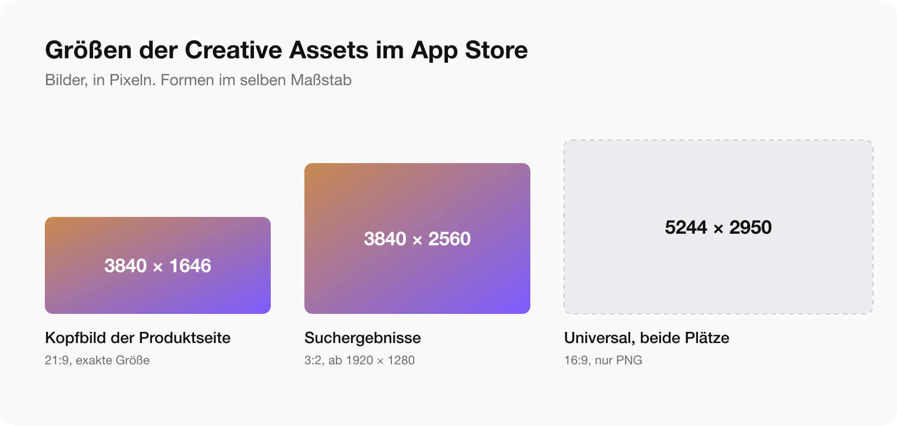
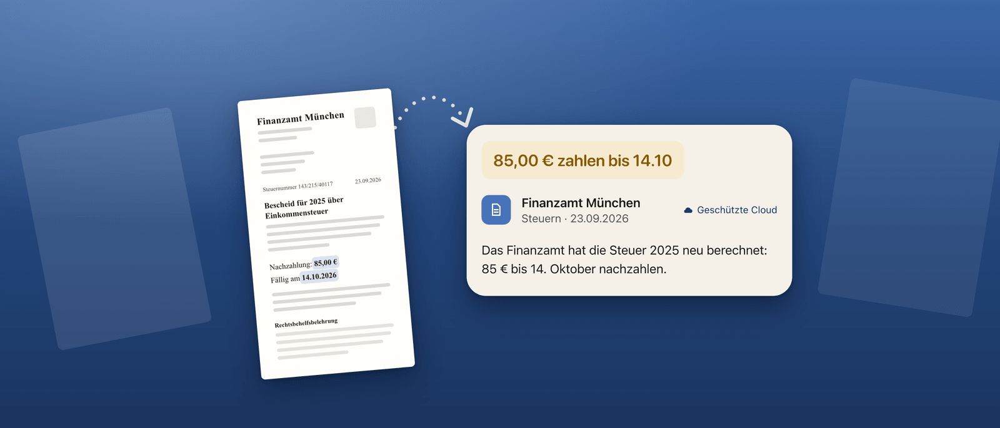
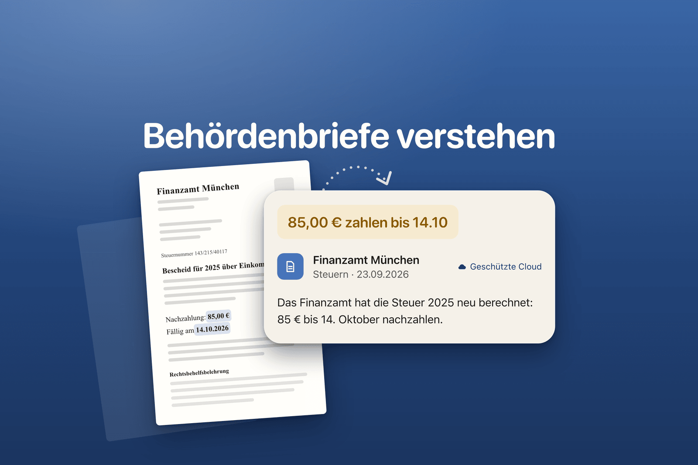

Seit dem 5. Oktober 2026 kann eine App im App Store zwei neue Bilder haben: ein Kopfbild oben auf der Produktseite und ein eigenes Bild in den Suchergebnissen. Apple nennt sie Creative Assets. Sie sind freiwillig, erscheinen ab iOS 27 und iPadOS 27 und werden getrennt von der App geprüft.

Für [Postklar](/de/apps/postklar/) habe ich sie am Abend darauf hochgeladen: 14 Bilder in sieben Sprachen, alles über die App Store Connect API. Hier stehen die Größen, die Regeln, die genauen Schritte und eine ehrliche Liste dessen, was ich noch nicht weiß. Als ich das schrieb, warteten alle 14 noch auf das Review. Nachtrag vom 9. Oktober: Alle sind freigegeben, zusammen mit den Bildern von sechs weiteren Apps. 69 Bilder, keine Ablehnung. Die Zahlen stehen unten.

## Die Größen

Bilder, laut Apples Spezifikation:

| Platz | Verhältnis | Größe in Pixeln | Format |
|---|---|---|---|
| Kopfbild der Produktseite | 21:9 | 3840 × 1646, exakt | JPG oder PNG |
| Suchergebnisse | 3:2 | 1920 × 1280 bis 3840 × 2560 | JPG oder PNG |
| Universal, für beide Plätze | 16:9 | 5244 × 2950, exakt | nur PNG |

Keine Transparenz. Ein Bild mit Alphakanal wird nicht angenommen.

Video geht an denselben zwei Plätzen:

| Platz | Verhältnis | Größe in Pixeln | Länge | Bildrate |
|---|---|---|---|---|
| Kopfbild der Produktseite | 21:9 | 3840 × 1646 | 5 bis 30 s | 30 oder 60 fps |
| Suchergebnisse | 3:2 | 1920 × 1280 bis 3840 × 2560 | 5 bis 30 s | 30 oder 60 fps |

Formate sind MOV, M4V oder MP4. Videos laufen in Schleife und starten stumm. In der Suche lässt sich der Ton gar nicht einschalten. Ein Video, das nur mit Ton verständlich ist, funktioniert dort also nicht. Ein universelles 16:9-Video führt die Spezifikation nicht auf.

## Was nicht drauf darf

- Preise und Rabatte.
- Internetadressen.
- Das Copyright-Zeichen.
- Auszeichnungen, die es nicht gab, und Apples eigene Abzeichen wie Editors' Choice oder App des Tages.
- Logos anderer Plattformen und Stores.

Eine Regel hat mich überrascht: Jedes Bild muss zur Altersfreigabe 4+ passen, auch wenn die App selbst höher eingestuft ist. Ein Shooter ab 17 braucht trotzdem ein Kopfbild, das ein kleines Kind ansehen könnte.

## Braucht man sie

Nein. Wer für die Suche nichts hochlädt, sieht dort dasselbe wie bisher: In-App-Events, App-Vorschauen und Screenshots.

Ob ein eigenes Bild mehr Downloads bringt als eine Reihe Screenshots, kann ich nicht sagen. Außerhalb von Apple hat noch niemand Zahlen, und meine sind null, weil meine Bilder noch nicht live sind.

## Was wir für Postklar gemacht haben

Zwei getrennte Bilder pro Sprache, nicht das universelle.

Das Kopfbild hat gar keinen Text. Apples Rat dafür ist eine klare Idee, und der App-Name steht auf der Seite ohnehin direkt darunter.

Das Suchbild trägt eine kurze Zeile. In der Suche hat sich jemand noch für nichts entschieden, und Apples Rat dort lautet: das Offensichtliche sagen und die Oberfläche zeigen.

Dieser Unterschied ist der Grund, warum wir die universelle 16:9-Datei nicht genommen haben. Eine Datei an beiden Plätzen heißt gleich viel Text an beiden Plätzen.

Der Brief im Bild ist erfunden. Es wurde kein echtes Dokument verwendet.

Sieben Sprachen, je zwei Bilder, 14 Dateien mit etwa 1 MB. Britisches Englisch bekommt das amerikanische Paar.

Arabisch wird von rechts nach links gelesen, also ist das ganze Layout gespiegelt.

Nichts davon wurde in einem Grafikprogramm gezeichnet. Die Bilder sind eine HTML-Vorlage, die ein Skript als PNG rendert. Ein zweites Skript prüft Größe, Transparenz und Ränder. Bei 14 Dateien, und noch mehr an dem Tag, an dem wir ein Wort ändern, kam Handarbeit nicht in Frage.

## Upload über die API, Schritt für Schritt

In App Store Connect gibt es einen neuen Bereich, die Asset Library. Dort liegen Screenshots, App-Vorschauen und Creative Assets in einer Liste.

Man kann dort von Hand hochladen. Wir haben alles über die API gemacht, ich habe nur zugesehen, wie sich die Liste füllt. Der Abschnitt der API heißt App Asset Library. Die Aufrufe der Reihe nach:

1. `GET /v1/apps/{id}/assetLibrary` liefert die Bibliothek der App.
2. `GET /v1/appAssetLibraryRefData` liefert Apples Referenzdaten: erlaubte Größen, Platzierungsarten und Grenzen. Von hier kommen die Namen der zwei Plätze: `PRODUCT_PAGE_HEADER_ASSET` und `APP_STORE_SEARCH_RESULTS_ASSET`.
3. `POST /v1/appAssetLibraryImages` reserviert ein Bild: Dateiname, Größe in Bytes, Kategorie `CREATIVE_ASSETS`, Verknüpfung zur Bibliothek. Die Antwort enthält Upload-Adressen.
4. `PUT` schickt die Bytes an diese Adresse. Sie ist befristet, und das API-Token wird nicht mitgesendet.
5. `PATCH /v1/appAssetLibraryImages/{id}` mit `"uploaded": true` bestätigt den Upload. Eine Prüfsumme ist nicht nötig, anders als beim alten Screenshot-Upload.
6. `GET /v1/appAssetLibraryImages/{id}` wiederholen, bis der Status von `UPLOAD_COMPLETE` auf `PREPARE_FOR_SUBMISSION` wechselt. Bei uns dauerte das zwischen ein paar Sekunden und ein paar Minuten pro Datei.
7. `POST /v1/reviewSubmissions` mit Plattform `IOS` legt eine Einreichung an.
8. `POST /v1/reviewSubmissionItems` fügt der Einreichung ein Bild hinzu. Ein Aufruf pro Datei.
9. `PATCH /v1/reviewSubmissions/{id}` mit `"submitted": true` schickt sie ab.
10. Nach der Freigabe: `POST /v1/appAssetLibraryPlacements` weist ein Bild einer Lokalisierung der App-Version zu. Man sendet einen `placementType` und zwei Beziehungen, `appStoreVersionLocalization` und `image`. Die Antwort kommt sofort mit dem Status `ACTIVE` zurück.

Ein Detail fehlt in der Dokumentation. In Schritt 8 ist für eine Einreichung, die nur Bilder enthält, nirgends benannt, wie die Beziehung zum Bild heißt. `appAssetLibraryImage` hat beim ersten Versuch funktioniert.

Ein Hinweis für alle, die Apples API-Dokumentation mit einem Skript lesen: Die Seiten werden per JavaScript aufgebaut, eine einfache Anfrage liefert nichts Brauchbares. Derselbe Inhalt liegt als JSON unter `developer.apple.com/tutorials/data/documentation/appstoreconnectapi/`, gefolgt vom Seitennamen und `.json`.

Alle 14 Dateien wurden beim ersten Versuch angenommen, und Apple hat jede Größe richtig erkannt.

## Das Review läuft getrennt von der App-Version

Das ist der Teil, der die Arbeit verändert. Die 14 Bilder gingen als eine Einreichung ins Review, ohne neuen Build und ohne neue App-Version. Die App hatte schon eine freigegebene Version, und das reicht.

Eine Bedingung gibt es, und wir haben sie durch Ausprobieren gefunden. Man kann ein Bild einer Version zuweisen, die schon im Verkauf ist, aber nur ein freigegebenes Bild. Beim Versuch mit einem wartenden Bild antwortete die API:

> The asset must be in the APPROVED state because the parent is already approved

Die Reihenfolge steht also fest: hochladen, Review, dann Platzierung.

Eingereicht haben wir am 6. Oktober um 22:37 Uhr Berliner Zeit. Am Abend danach, mehr als 20 Stunden später, stand der Status weiter auf Waiting for Review. Zum Vergleich: In [meinen Daten zur Review-Dauer](/de/blog/app-store-review-dauer-2026/) lag die mittlere Wartezeit einer App-Version bei 20 Stunden.

Nachtrag vom 9. Oktober. Alles, was wir als Bild eingereicht haben, ist freigegeben: 69 Bilder in sieben Apps, und keine einzige Ablehnung.

| App | Bilder | Eingereicht, UTC | Freigegeben, UTC | Stunden |
|---|---|---|---|---|
| Fundkeep | 12 | 6. Okt., 20:40 | 9. Okt., 06:10 | 57,5 |
| SawKit | 16 | 6. Okt., 20:40 | 9. Okt., 16:07 | 67,5 |
| Roomkeep | 18 | 6. Okt., 20:40 | 9. Okt., 16:15 | 67,6 |
| Postklar | 14 | 6. Okt., 20:37 | 9. Okt., 16:15 | 67,6 |
| AI Photo Generator | 3 | 7. Okt., 17:32 | 9. Okt., 16:28 | 46,9 |
| AI Video Generator | 3 | 7. Okt., 17:32 | 9. Okt., 16:25 | 46,9 |
| Text to Music | 3 | 7. Okt., 17:32 | 9. Okt., 15:42 | 46,2 |

Drei Dinge fallen auf.

Die Wartezeit lag zwischen 46 und 68 Stunden, der mittlere Wert bei 57,5. Das ist etwa das Dreifache der mittleren Wartezeit einer App-Version.

Früher einreichen hat nicht geholfen. Die Einreichungen vom 6. Oktober warteten rund 68 Stunden, die vom 7. Oktober rund 47, und fast alle wurden in einer Welle am Nachmittag des 9. Oktober freigegeben. Vier Einreichungen, die innerhalb von drei Minuten rausgingen, wurden mit zehn Stunden Abstand freigegeben.

Innerhalb einer Einreichung werden alle Dateien in derselben Sekunde freigegeben.

Eine Anmerkung zu den Zahlen: Die API hat kein Feld für den Zeitpunkt der Freigabe. Das hier ist der Zeitpunkt der letzten Änderung an einem freigegebenen Bild, und der ist bei allen Dateien einer Einreichung gleich.

Video ist eine andere Geschichte. Die sechs Videos von Fundkeep gingen am 6. Oktober um 20:22 UTC raus, achtzehn Minuten vor den Bildern derselben App. Nach mehr als 70 Stunden warten sie immer noch.

## Platzierung, und was die Preview zeigt

Ergänzt am 9. Oktober, nach der Freigabe für Fundkeep. Die freigegebenen Bilder haben wir über die API platziert. Inzwischen sind alle sieben Apps platziert, jede auf einer Version, die schon im Verkauf war.

Bei Fundkeep stand eine Sache im Weg. Es lief ein Test der Produktseitenoptimierung, und die API antwortete mit `STATE_ERROR.EXPERIMENT_IN_PROGRESS`: „Creating a placement is not permitted while AppStoreVersion has a running experiment“. Nach dem Stoppen des Tests ging es durch.

Eine Datei kann mehrere Sprachen bedienen. Postklar hat 14 Dateien und 16 Platzierungen, weil britisches Englisch das amerikanische Paar nutzt.

In App Store Connect steht das Ergebnis auf der Seite der App-Version, in einem neuen Reiter namens Header and Search Results. Er hat zwei Plätze, und jeder nimmt ein Bild pro Sprache. Die Version hier ist schon im Verkauf. Eine neue Version war nicht nötig.

Der Preview-Knopf öffnet eine Gerätevorschau. Hier sieht man den echten Beschnitt zum ersten Mal.

Was ich auf diesen zwei Bildschirmen gemessen habe, iPhone im Hochformat:

- **Kopfbild.** Die volle Höhe ist zu sehen. Die Seiten werden beschnitten: etwa 8 Prozent links und 8 Prozent rechts, sichtbar bleiben also rund 84 Prozent der Breite.
- **Kopfbild, obere Ecken.** Der Zurück-Knopf und der Teilen-Knopf liegen auf dem Bild, links und rechts. Die Fläche über dem Bild, unter der Dynamic Island, wird mit der Farbe der oberen Bildkante gefüllt.
- **Suchbild.** Das 3:2-Bild wird ganz gezeigt, mit runden Ecken. Nichts wird abgeschnitten.

Für ein Kopfbild heißt das: nichts Wichtiges in den äußeren 10 Prozent auf jeder Seite und nichts in den oberen Ecken. Unser eigener Rand war strenger als nötig.

Diese Zahlen sind an einem Screenshot der Preview gemessen, für ein Gerät in einer Ausrichtung. Apple schreibt daneben, dass die Vorschau nur zur Orientierung dient. Die Preview hat auch eine iPad-Option, die habe ich noch nicht gemessen.

## Video: eine Datei, die durchging

Ergänzt am 8. Oktober. Für eine zweite App, [Fundkeep](/de/apps/fundkeep/), haben wir ein Video für den Suchplatz in sechs Sprachen gemacht. Das habe ich von Hand in der Asset Library hochgeladen, über das Plus. Alle sechs Dateien wurden ohne Fehler und ohne Warnung verarbeitet.

Die Datei:

| Eigenschaft | Wert |
|---|---|
| Bildgröße | 1920 × 1280, Verhältnis 3:2 |
| Länge | 8,83 s |
| Bildrate | 30 fps |
| Container | MP4 |
| Videocodec | H.264, Profil High, yuv420p |
| Bitrate | etwa 5,6 Mbit/s |
| Dateigröße | 6,2 MB |
| Ton | eine stumme Stereo-AAC-Spur, 48 kHz |

Ob die stumme Tonspur eine Rolle spielt, weiß ich nicht. Eine Datei ohne haben wir nicht probiert.

Ein Vorschaubild lädt man nicht hoch. Apple hat selbst eines gewählt, bei allen sechs Dateien an der Fünf-Sekunden-Marke. Einen Weg, es zu ändern, habe ich nicht gefunden.

Hochgeladen und verarbeitet heißt nicht freigegeben. Die sechs Videos warten seit dem Abend des 6. Oktober auf das Review. Die Bilder vom selben Abend sind freigegeben.

Video gibt es auch in der API, als `appAssetLibraryVideos`. Wir haben es dort nur gelesen, nicht darüber hochgeladen.

## Vier API-Fehler bei der zweiten App

Postklar lief ohne einen einzigen Fehler durch. Fundkeep, von einer anderen Sitzung gemacht, nicht. Das sind die Meldungen und was geholfen hat:

- `The attribute 'specId' can not be included in a 'CREATE' operation`. Beim Reservieren eines Bildes keine Größenangabe mitsenden. Apple leitet den Platz aus der Pixelgröße ab.
- `'sourceFileChecksum' is not an attribute on the resource`. Prüfsumme weglassen. `"uploaded": true` ist die ganze Bestätigung.
- `STATE_ERROR.ASSET_IN_POST_PROCESSING`. Zu früh eingereicht. Wir haben etwa eine Minute gewartet.
- `MAX_IN_REVIEW_SUBMISSIONS_PER_PLATFORM_LIMIT_REACHED`. Nicht mehr als zwei Einreichungen pro Plattform gleichzeitig. Alles in eine packen.

## Wo es schwierig wurde

**Für den sicheren Bereich gibt es keine öffentlichen Zahlen.** Apple schreibt, dass Kopfbild und Suchbild je nach Gerät und Ausrichtung unterschiedlich beschnitten werden und dass das Wichtige in die Mitte gehört. Die genauen Grenzen stehen nur in Apples Vorlagen für Figma, Photoshop, Pixelmator und Sketch. Wir haben sie nicht geöffnet.

Also haben wir einen eigenen Rand gesetzt: alles Wichtige in den mittleren 60 Prozent der Breite und 70 Prozent der Höhe, kein Text näher als 8 Prozent am Rand, der Hintergrund läuft bis an die Kanten und enthält dort nichts von Bedeutung. Das ist unsere Annahme, nicht Apples Regel. Den echten Beschnitt zeigt das Preview-Werkzeug in App Store Connect, sobald die Bilder platziert sind. Was es bei unserer zweiten App gezeigt hat, steht weiter unten.

**Die Beschnittprüfung war falsch, bevor es die Bilder waren.** Das Skript für die Ränder hat das Browserfenster gemessen, das 87 Pixel niedriger war als die Zeichenfläche, und richtige Bilder abgelehnt. Der erste Fehler, den wir behoben haben, steckte im Prüfer.

**Layout in sieben Sprachen.** Die russische und die polnische Absenderzeile brachen auf drei Zeilen um. Die Überschrift lief in den Brief. In der arabischen Fassung verdeckte die Karte den markierten Betrag und das Datum. Jedes davon wurde einzeln behoben.

**Die Überschrift selbst.** Die ersten russischen, ukrainischen und polnischen Zeilen hatten einen Bindestrich, wo ein Gedankenstrich hingehört. In einer großen Überschrift sah das wie ein Tippfehler aus. Wir haben die Zeilen so umgeschrieben, dass sie keinen von beiden brauchen. Die deutsche wurde zu „Behördenbriefe verstehen“, damit ein Wort drinsteht, nach dem Leute suchen.

**Eine Regel, die ich nicht sicher lesen kann.** Preise sind verboten. Auf unserer Karte steht groß „85,00 € zahlen bis 14.10“. Das ist der Betrag aus dem erfundenen Brief, nicht der Preis der App, und derselbe Betrag steht auf unseren freigegebenen Screenshots. Wer die Regel wörtlich liest, könnte es trotzdem ablehnen. Ich weiß es, wenn das Review durch ist.

Nachtrag vom 9. Oktober: Es ist durchgegangen. Alle 14 Bilder von Postklar wurden freigegeben, und der Betrag steht auf jedem davon. Auf den Bildern von Fundkeep steht „$590.00“ in der Oberfläche der App, ein Budgetstand, und auch die sind durch. Ein Betrag, der zum gezeigten Inhalt gehört, zu einem Brief oder einem Budget, hat das Review also bestanden. Den Preis der App selbst würde ich trotzdem nicht auf ein Bild setzen.

## Was ich noch nicht weiß

- Wie lange das Review eines Videos dauert. Unsere warten seit mehr als 70 Stunden.
- Was auf einem iPad und im Querformat abgeschnitten wird. Für ein iPhone im Hochformat habe ich eine erste Messung.
- Ob das alles etwas an den Downloads ändert.

Dieser Artikel wird ergänzt, sobald Antworten kommen.

## Kurze Liste für die eigene App

1. Zwischen zwei Bildern und einer universellen Datei entscheiden. Zwei erlauben unterschiedlichen Text für Seite und Suche.
2. In exakter Größe exportieren: 3840 × 1646 für das Kopfbild, 3840 × 2560 für die Suche. Keine Transparenz.
3. Das Wichtige in die Mitte, der Hintergrund läuft bis an die Kanten.
4. Das Bild gegen die Freigabe 4+ prüfen, auch wenn die App nicht 4+ ist.
5. Preise, Internetadressen und Copyright-Zeichen entfernen.
6. Den Text lokalisieren und das Layout für Sprachen von rechts nach links spiegeln.
7. Früh einreichen. Das Review läuft für sich, und vor der Freigabe lässt sich kein Bild platzieren.
8. Bei vielen Dateien ein Skript schreiben. Die zehn Aufrufe oben sind der ganze Ablauf.

## Fragen, die gestellt werden

### Wie groß ist das Kopfbild der Produktseite im App Store?

3840 × 1646 Pixel, Verhältnis 21:9, JPG oder PNG ohne Transparenz. Die Größe ist exakt, einen Bereich gibt es nicht.

### Wie groß ist das Bild für die Suchergebnisse im App Store?

Verhältnis 3:2, von 1920 × 1280 bis 3840 × 2560 Pixel, JPG oder PNG ohne Transparenz.

### Wie groß ist der sichere Bereich des Kopfbilds?

Apple veröffentlicht außerhalb der Designvorlagen keine Zahlen. In der Preview, auf einem iPhone im Hochformat, behielt unser 21:9-Kopfbild die volle Höhe und verlor etwa 8 Prozent auf jeder Seite. Zurück- und Teilen-Knopf verdecken die oberen Ecken. Das 3:2-Suchbild wurde ganz gezeigt.

### Kann ein Bild für Kopfbild und Suche zugleich dienen?

Ja. Apple nennt es das universelle Creative Asset: 5244 × 2950 Pixel, 16:9, nur PNG. Der Preis dafür: An beiden Plätzen stehen dasselbe Bild und derselbe Text.

### Brauchen Creative Assets eine neue App-Version?

Nein. Sie gehen in eine eigene Einreichung. Die App braucht eine freigegebene Version, und ein Bild muss freigegeben sein, bevor es platziert werden kann.

### Wie lange dauert das Review von Creative Assets?

Bei uns zwischen 46 und 68 Stunden: sieben Einreichungen mit 69 Bildern, abgeschickt am 6. und 7. Oktober 2026 und alle am 9. Oktober freigegeben. Keine wurde abgelehnt. Das ist die erste Woche der Funktion, keine Regel. Videos vom selben Abend warteten nach 70 Stunden noch.

### Sind Creative Assets Pflicht?

Nein. Ohne eigenes Suchbild zeigt der App Store wie bisher In-App-Events, App-Vorschauen und Screenshots.

### Funktionieren sie im Mac App Store?

Apple nennt iOS 27 und iPadOS 27 und neuer. Für meine Mac-Apps habe ich nichts hochgeladen.

Quellen: Apples [Best Practices für Assets](https://developer.apple.com/app-store/asset-best-practices/) und die [Spezifikation der Creative Assets](https://developer.apple.com/help/app-store-connect/reference/app-information/creative-assets-specifications/).
