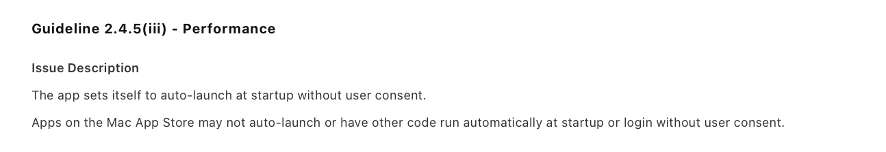
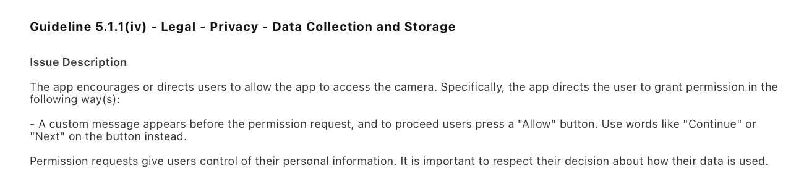
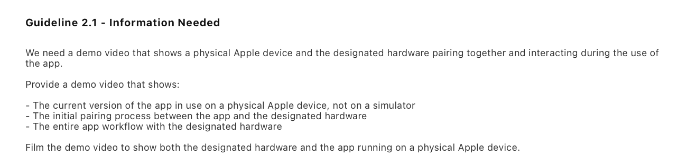
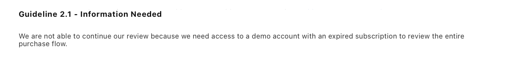
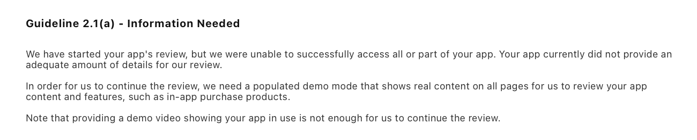

CamDial ist seit dem 19. September 2026 im Mac App Store. Dafür brauchte es fünf Einreichungen, vier Ablehnungen und fünfzehn Tage. Den größten Teil der Verzögerung haben wir selbst verursacht, und genau das ist der nützliche Teil.

Wenn du hier gelandet bist, weil du den Text einer Ablehnung in die Suche kopiert hast: Spring zu deiner Guideline. Jeder Abschnitt enthält Apples Wortlaut im Original, was praktisch gemeint war, und die Änderung, mit der es durchging.

[CamDial](/de/apps/camdial/) ist eine App für die Menüleiste, die USB-Webcams am Mac einstellt: Belichtung, Weißabgleich, Fokus, Zoom. Sie speichert das als Presets und stellt sie wieder her, wenn die Kamera neu verbunden wird. Ein In-App-Kauf, einmalig. Kein Login, keine Konten, kein Abo. Merk dir den letzten Satz, er wird noch wichtig.

## Der Ablauf

| Runde | Eingereicht | Antwort von Apple | Build | Guideline |
|---|---|---|---|---|
| 1 | 4. Sep. | 8. Sep., abgelehnt | 1.0 (3) | 2.4.5(iii) |
| 2 | 9. Sep. | 11. Sep., abgelehnt | 1.0 (4) | 5.1.1(iv) |
| 3 | 11. Sep. | 14. Sep., abgelehnt | 1.0 (5) | 2.1, zwei Punkte |
| 4 | 14. Sep. | 16. Sep., abgelehnt | 1.0 (5) | 2.1(a) |
| 5 | 16. Sep. | freigegeben, im Verkauf am 19. Sep. | 1.0 (6) | keine |

Jede Korrektur ging am selben oder am nächsten Tag zurück. Gewartet haben wir auf die Warteschlange, zwei bis vier Tage pro Runde. Das Prüfgerät wechselte mittendrin. Es sieht so aus, als hätten verschiedene Prüfer jeweils beim ersten Fund aufgehört. Das würde erklären, warum die Punkte einzeln kamen und nicht als Liste. Das ist eine Vermutung, kein Fakt.

## Ablehnung 1: Guideline 2.4.5(iii), Autostart ohne Zustimmung

Apple schrieb:



> The app sets itself to auto-launch at startup without user consent.

Auf dem ersten Bildschirm der Einführung trug sich die App mit `SMAppService.mainApp.register()` selbst als Anmeldeobjekt ein, sobald der Bildschirm erschien. Der Schalter „Launch CamDial at login“ war direkt daneben, sichtbar eingeschaltet, mit einem Klick auszuschalten. Wir dachten: sichtbar heißt ehrlich, und ehrlich heißt erlaubt.

Heißt es nicht. Zustimmung ist etwas, das der Nutzer tut. Eine Voreinstellung, die wir für ihn gewählt haben, ist keine Zustimmung, auch wenn er sie sehen kann.

Die Korrektur: 11 gelöschte Zeilen in zwei Dateien, keine einzige neue. Der Schalter blieb, wo er war, jetzt standardmäßig aus.

Der Fehler lag nicht im Code. In unserem Design-Briefing stand „Autostart standardmäßig an, klar sichtbar“, und genau das wurde gebaut. Die Anforderung selbst war der Verstoß.

Ein Detail hat uns eine zweite Ablehnung zum selben Punkt erspart. Der alte Build hatte sich auf dem Mac des Prüfers schon eingetragen, und der neue Build entfernt solche Einträge absichtlich nicht. Sonst würde er die Entscheidung eines echten Nutzers still rückgängig machen. Also baten wir den Prüfer in der Antwort, das alte Anmeldeobjekt zuerst zu entfernen oder mit einem frischen Benutzer zu testen. Der Punkt kam nie wieder.

## Ablehnung 2: Guideline 5.1.1(iv), ein Button mit „Allow“

Apple schrieb:



> A custom message appears before the permission request, and to proceed users press a "Allow" button. Use words like "Continue" or "Next" on the button instead.

Ein eigener Bildschirm, der vor der Systemabfrage erklärt, wozu die Kamera gebraucht wird, ist in Ordnung. Unserer sagte sogar, dass alles auch ohne Kamerazugriff funktioniert. Das Problem war der Button. „Allow camera access“ auf unserem eigenen Bildschirm liest sich, als würde die Erlaubnis dort erteilt und nicht im macOS-Dialog danach.

Die Korrektur: zwei Texte in zwei Dateien. Aus „Allow camera access“ wurde „Continue“. Ein zweiter Bildschirm vor derselben Abfrage sagte „Show preview“, auch daraus wurde sicherheitshalber „Continue“. Hinter den Buttons änderte sich nichts.

Auch diese Formulierung kam aus unserem Briefing, und niemand hat sie gegen 5.1.1(iv) gehalten. Wenn dein Bildschirm vor einer Berechtigungsabfrage einen Button hat: „Allow“, „Grant“ und „Enable“ gehören nicht darauf.

## Ablehnung 3: Guideline 2.1, ein Demo-Video und ein Abo, das es nicht gibt

Diesmal zwei Punkte. Der erste:



> We need a demo video that shows a physical Apple device and the designated hardware pairing together and interacting during the use of the app.

Der Prüfer hatte keine USB-Webcam und konnte die Hauptfunktion nicht testen. Für Apps, die externe Hardware brauchen, ist das eine Standardanfrage, und wir hätten sie kommen sehen müssen.

Wir haben knapp drei Minuten mit dem iPhone gedreht, nach einem Ablauf mit zwölf Schritten. Mac und Kamera in einem Bild, Einstecken, erster Start, Einstellungen am Livebild ändern, Presets, Ausstecken und zusehen, wie die Einstellungen zurückkommen, der Kauf. Die Kamera zeigte auf einen Gegenstand auf dem Tisch, nicht auf einen Menschen. Ein praktischer Hinweis: Lade das Video als „nicht gelistet“ hoch, nicht als „privat“. Ein privates Video kann der Prüfer nicht öffnen. Der Link stand in der ersten Zeile der Hinweise für das Review.

Der zweite Punkt:



> We are not able to continue our review because we need access to a demo account with an expired subscription to review the entire purchase flow.

CamDial hat keine Konten, keinen Login und keine Abos. Wir haben in App Store Connect nachgesehen, um sicher zu sein: null Abo-Gruppen, ein Kauf, einmalig. Unsere beste Erklärung ist, dass eine Vorlage auf die Worte „No subscription“ in unserer eigenen Beschreibung angesprungen ist. Wir haben mit diesen Fakten geantwortet, ohne Diskussion. Der Punkt wurde nicht wiederholt.

## Ablehnung 4: Guideline 2.1(a), „we need a populated demo mode“

Apple schrieb:



> In order for us to continue the review, we need a populated demo mode that shows real content on all pages for us to review your app content and features, such as in-app purchase products.
>
> Note that providing a demo video showing your app in use is not enough for us to continue the review.

Diesen Abschnitt lohnt es sich langsam zu lesen, denn wir lagen erst falsch und dann richtig.

Was der Prüfer sah: Ohne Kamera zeigte ein Klick auf das Symbol in der Menüleiste nur „Waiting for a USB camera“ und keinen einzigen Button. Einstellungen und Kaufbildschirm lagen hinter einem Rechtsklick, den der Prüfer nicht ahnen konnte. Für ihn war die App leer, und den In-App-Kauf gab es nicht.

Was wir zuerst taten: Wir nahmen das vorgeschlagene Mittel wörtlich. Wir schrieben eine Spezifikation für einen kompletten Demo-Modus mit simulierter Kamera und einem Bild, das auf die Regler reagiert, und die Entwicklung fing an. Gestoppt hat das eine Frage von mir: Welche normale App für Kameraeinstellungen hat einen Demo-Modus?

Dann haben wir die Guideline gelesen. 2.1(a) erwähnt einen Demo-Modus nur in einem Fall, als Ersatz für ein Demo-Konto:

> If you are unable to provide a demo account due to legal or security obligations, you may include a built-in demo mode in lieu of a demo account with prior approval by Apple.

CamDial hat keinen Login, das trifft also nicht zu. Die eigentliche Pflicht steht nebenan in 2.1(b):

> If you offer in-app purchases in your app, make sure they are complete, up-to-date, visible to the reviewer and functional.

Und darin hatte der Prüfer recht. Er konnte den Kauf nicht finden. Den Demo-Modus haben wir am selben Tag gestrichen und das echte Problem in drei Commits gelöst:

1. **Buttons ohne Kamera.** Das leere Fenster hat jetzt „CamDial Pro…“ und „Settings…“. Die meisten neuen Zeilen waren Übersetzungen in acht Sprachen.
2. **Kein Preis im Code.** Für den Moment, bevor das Produkt aus dem Store geladen ist, war ein Ersatzpreis fest eingetragen, und er stimmte nicht mit dem echten überein. Jetzt zeigt der Button keinen Preis, bis StoreKit antwortet. Außerdem haben wir das Pro-Versprechen „unbegrenzt viele Kameras“ entfernt, denn Kameras waren in der Gratisversion nie begrenzt.
3. **Produkt erneut laden.** Das Produkt wurde einmal beim Start geladen. Schlug das fehl, was in der Prüfumgebung vorkommt, meldete der Kaufbutton bis zum Neustart, der App Store sei nicht erreichbar. Jetzt versucht die App es vor dem Kauf und beim Öffnen des Kaufbildschirms noch einmal.

Die Hinweise für das Review haben wir neu geschrieben. Der erste Block ist jetzt der genaue Klickweg zum Kauf ohne Kamera. In der Antwort haben wir den Demo-Modus höflich abgelehnt, mit dem Text von 2.1(a), auf den neuen Button unter 2.1(b) verwiesen und die App mit einem Druckerprogramm verglichen, das einen Drucker braucht. Die nächste Antwort war die Freigabe.

## Wonach niemand gefragt hat: Die Beschreibung versprach Dinge, die es nicht gab

Als das Review um den Kauf kreiste, haben wir jedes Pro-Versprechen in der Store-Beschreibung mit dem Code verglichen. Sechs Versprechen. Zwei waren echte Pro-Funktionen. Zwei beschrieben Dinge, die ohnehin kostenlos waren. Zwei beschrieben Funktionen, die es in der App gar nicht gab.

Drei Prüfrunden hatten das nicht bemerkt, und wir auch nicht. Korrigiert wurde es in allen zehn Sprachen vor der fünften Einreichung, kein Käufer hat den alten Text je gesehen. Beim Korrigieren ist uns dann eine dritte echte Pro-Funktion aus der Liste gefallen. Die App stand schlechter da, als sie ist, bis es jemandem auffiel.

Gut zu wissen: Die Beschreibung des In-App-Kaufs selbst lässt sich nicht ändern, solange der Kauf in einer Einreichung steckt. App Store Connect antwortet mit 409. Mach sie vor dem Einreichen richtig.

## Was beim App Review funktioniert hat und was nicht

Wir haben nach jeder Ablehnung in App Store Connect geantwortet und nie beim App Review Board Einspruch eingelegt. Zweimal haben wir es erwogen und als Reserve behalten.

**Funktioniert hat:**

- Kurze Antworten: was wir einsehen, was geändert wurde, wo es zu finden ist, wie man es in dreißig Sekunden prüft.
- Den Text der Guideline zitieren, als wir den Demo-Modus ablehnten.
- Die echte Ursache beheben, nicht das Mittel, das der Prüfer vorschlägt.
- Ein beschleunigtes Review. Wir haben es einmal beantragt, am 14. September. Das Formular fragt 2026 nur nach App-Name und Plattform. Es wurde sofort gewährt und galt ohne neuen Antrag auch für die nächste Einreichung.

**Nicht funktioniert hat:**

- Ein Video als Ersatz dafür, dass der Prüfer die App selbst bedient. Apple hat das deutlich gesagt.
- Die Hoffnung, dass ein Prüfer eine Funktion hinter einem Rechtsklick findet.

Und eine mechanische Falle. Wenn du einen neuen Build hochlädst, reicht die Antwort an den Prüfer nicht. Du musst „Resubmit to App Review“ drücken. Sonst bleibt die Version in „Prepare for Submission“ liegen, und niemand öffnet sie.

## Checkliste vor dem Einreichen einer Mac-App

**Die Regeln, über die wir gestolpert sind**

- Die App trägt sich nie selbst in den Autostart ein. Nur nach einer Handlung des Nutzers, auch wenn der Schalter sichtbar ist. 2.4.5(iii).
- Buttons auf Bildschirmen vor einer Systemabfrage heißen „Continue“ oder „Next“. 5.1.1(iv).
- Braucht die App externe Hardware, öffnet sich alles, was sie nicht physisch braucht, mit einem normalen Klick: Einstellungen, Kaufbildschirm. Der Kauf ist sichtbar und funktioniert. 2.1(b).
- Ein Video mit Hardware und Mac in einem Bild steht ab der ersten Einreichung in den Hinweisen für das Review.

**Hinweise für das Review**

- Erster Block: der genaue Klickweg zum Kauf.
- Sag es klar, wenn es stimmt: kein Login, keine Konten, keine Abos.
- Welche Hardware nötig ist und wozu jedes Entitlement dient.

**Käufe und Beschreibung**

- Jedes bezahlte Versprechen in der Beschreibung, in der Kaufbeschreibung, auf dem Kaufbildschirm und auf der Website ist mit dem verglichen, was der Code wirklich sperrt.
- Keine Preise im Code, nur aus StoreKit. Das Laden des Produkts wird wiederholt.

**Während des Reviews**

- Bevor du baust, was ein Prüfer vorschlägt, lies die Guideline, die er nennt.
- Neuer Build heißt „Resubmit“.
- Ist die Frist echt, beantrage das beschleunigte Review gleich nach dem Einreichen.

## Befehle, die geholfen haben

Die Kameraabfrage erneut auslösen. macOS merkt sich die Antwort sogar, nachdem die App gelöscht wurde:

```
tccutil reset Camera <bundle id>
```

Die Einstellungen einer Sandbox-App liegen in `~/Library/Containers/<bundle id>/Data/Library/Preferences/`. Im Terminal antwortet `defaults delete <bundle id>` mit „Domain not found“, weil das Terminal standardmäßig nicht in die Container anderer Apps schauen darf. Lösche einzelne Schlüssel, nicht die ganze Datei.

Anmeldeobjekte und Hintergrunddienste auflisten:

```
sfltool dumpbtm
```

## Fragen, die Entwickler stellen

### Darf eine App aus dem Mac App Store den Autostart standardmäßig einschalten?

Nein. Nach 2.4.5(iii) darf sich die App nicht ohne Handlung des Nutzers eintragen, auch wenn die Einstellung sichtbar und leicht abzuschalten ist. Liefere den Schalter ausgeschaltet aus und lass den Nutzer ihn umlegen.

### Ist ein eigener Bildschirm vor der Kameraabfrage erlaubt?

Ja. Die Erklärung ist in Ordnung. Der Button muss neutral sein, „Continue“ oder „Next“. „Allow“ auf dem eigenen Button bringt eine Ablehnung nach 5.1.1(iv).

### Muss ich einen Demo-Modus bauen, wenn das App Review einen verlangt?

Nicht unbedingt. 2.1(a) bietet den Demo-Modus als Ersatz für ein Demo-Konto bei Apps mit Login an. Hat deine App keinen Login, finde heraus, was der Prüfer nicht erreichen konnte, mach es erreichbar und erkläre es in den Hinweisen. Bei uns war es der In-App-Kauf, also 2.1(b).

### Das App Review will ein Demo-Konto mit abgelaufenem Abo, aber meine App hat keine Abos. Was jetzt?

Antworte mit Fakten: keine Konten, kein Login, keine Abo-Gruppen, ein einmaliger Kauf. Nicht streiten. Bei uns war der Punkt in der nächsten Runde verschwunden.

### Wie bekomme ich ein beschleunigtes Review?

Über das Kontaktformular auf developer.apple.com, Thema „expedite“. Bei uns wurde es am selben Tag gewährt und galt auch für die erneute Einreichung.

## Wie das gebaut wurde

Wie alles auf dieser Seite wurde CamDial von KI-Agenten gebaut, die ich anleite: eine Sitzung plant und schreibt die Briefings, eine entwickelt, eine betreut die Website. Zwei der vier Ablehnungen gehen auf mein Briefing zurück, nicht auf den Code. Die Agenten haben gebaut, was ich bestellt habe. Das ist die Lehre, die ich mitnehme.

CamDial ist jetzt [im Mac App Store](/de/apps/camdial/). Wenn deine Webcam ihre Einstellungen jedes Mal vergisst, wenn der Mac aufwacht: Dafür ist die App gemacht.
