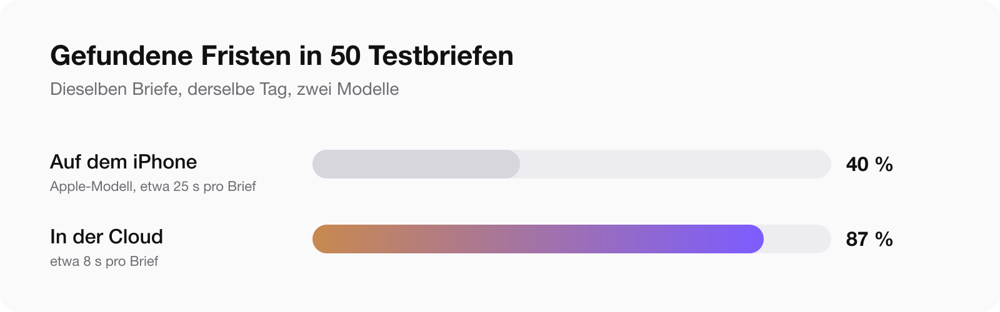
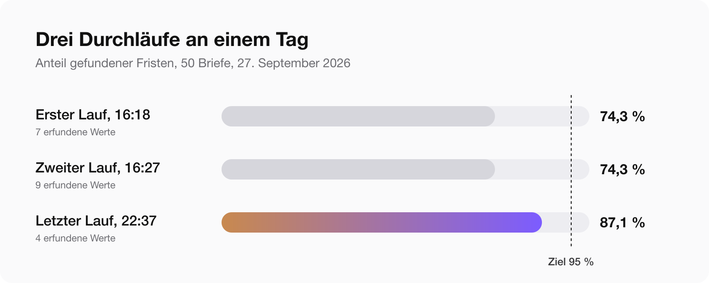

[Postklar](/de/apps/postklar/) ist seit heute im Verkauf. Du fotografierst einen Brief vom Amt, und die App sagt dir in einfachen Worten, was drinsteht, was du tun musst, bis wann und wie viel. In sieben Sprachen, denn wer das am dringendsten braucht, ist nicht mit Deutsch aufgewachsen.

Der erste Commit war am 27. September. Am Abend darauf ging die App ins App Review, am 3. Oktober in den Store. Sechs Tage.

Das ist keine Erfolgsgeschichte. Die App ist seit einem Tag im Verkauf, und ich weiß noch nichts darüber, wie sie mit den Briefen fremder Leute zurechtkommt. Es ist die Geschichte, wie sie gebaut wurde, und von drei Entscheidungen, die ich in jeder App wiederholen würde, die ein Sprachmodell zwischen einen Nutzer und etwas Wichtiges stellt.

## Das Konzept, das mir gefiel, verlor gegen eine Zahl

Der Plan hieß Privatsphäre zuerst. Apple liefert inzwischen ein Sprachmodell auf dem iPhone mit, also sollte der Brief auf dem Gerät erklärt werden, und die Cloud wäre eine Option für alle, die mehr wollen.

Das klang richtig. Es war auch die Version, über die ich schreiben wollte.

Bevor die Bildschirme gebaut wurden, haben wir 50 Testbriefe geschrieben: Finanzamt, Jobcenter, Krankenkasse, Gericht, Inkasso. Jeder mit bekannter Frist, bekanntem Betrag und Aktenzeichen. Dann liefen am selben Tag beide Modelle darüber.

Das Modell auf dem Telefon fand 19 von 47 Fristen. Das Cloud-Modell 61 von 70. Das eine brauchte etwa 25 Sekunden pro Brief, das andere etwa 8.

Ein Brief-Erklärer, der sechs von zehn Fristen übersieht, ist nicht privat, er ist nutzlos. Am selben Abend haben wir das Konzept umgedreht: Die Cloud ist der Standard, nach einem ausdrücklichen Einwilligungsbildschirm, der den Empfänger des Textes nennt, und das Modell auf dem Gerät ist ein privater Modus zum Einschalten.

Ohne die Testbriefe wäre die App mit einer schönen Architektur und einer schlechten Antwort erschienen.

Die Zahlen haben noch etwas gezeigt: Auf dem Mac liefen die Tests durch, auf dem Telefon scheiterten die ersten Builds. Apples Modell hat auf dem iPhone ein Kontextfenster von 4.096 Token, auf dem Mac das Doppelte. Ein zweiseitiger deutscher Brief plus Anweisungen passte nicht hinein. Der private Modus hat deshalb eigene, viel kürzere Anweisungen.

## Das Modell versteht, der Code rechnet

Diese Regel würde ich in jede andere App mitnehmen. Überall, wo ein Fehler Geld oder ein Recht kostet, darf das Modell den endgültigen Wert nicht selbst liefern.

**Zahlen werden mit dem Brief abgeglichen.** Nach der Antwort des Modells vergleicht gewöhnlicher Code jeden Wert mit dem Text, der auf der Seite erkannt wurde.

| Wert | So prüft der Code |
|---|---|
| Betrag | Muss eine der Zahlen sein, die im Brief gedruckt stehen |
| IBAN, Aktenzeichen | Vergleich ohne Leerzeichen und Satzzeichen; die IBAN-Prüfsumme wird berechnet |
| Genaues Datum | Muss im Brief gedruckt stehen |
| Relative Frist, „innerhalb eines Monats“ | Das Modell muss den Satz zitieren; der Code sucht das Zitat im Brief |

Was nicht im Brief steht, wird nicht gelöscht. Es bekommt ein Warnzeichen, damit du siehst, dass es nicht bestätigt ist.

Eine Kleinigkeit hat einen Nachmittag gekostet: Gescannter Text enthält unsichtbare Zeichen ohne Breite, und die haben gedruckte Zahlen vor der Prüfung versteckt.

**Daten rechnet nie das Modell aus.** Es liefert eine Regel: wie viele Tage oder Monate, ab wann gezählt, und das Zitat. Das Datum berechnet Code.

Diese Trennung gibt es wegen eines Fehlers. In den ersten Versionen hat das Modell selbst gerechnet und „ein Monat“ als 30 Tage geschrieben. Ein Monat und 30 Tage ergeben verschiedene Daten, und bei einer Widerspruchsfrist kann der Unterschied das Recht auf Widerspruch kosten.

Der Code folgt der gesetzlichen Vermutung: In Deutschland gilt ein Brief am vierten Tag nach der Aufgabe zur Post als zugestellt, in Österreich am dritten Werktag. Fällt die Frist auf ein Wochenende, rückt sie auf den Montag. Feiertage werden nicht berücksichtigt, und das steht in der App neben dem Datum, zusammen mit jeder anderen Annahme.

## Drei Durchläufe an einem Tag, und das Ziel verfehlt

| Lauf | Fristen | Beträge | Aktenzeichen | Erfundene Werte |
|---|---|---|---|---|
| Erster, 16:18 | 74,3 % | 76,5 % | 79,9 % | 7 |
| Zweiter, 16:27 | 74,3 % | 85,3 % | 96,3 % | 9 |
| Letzter, 22:37 | 87,1 % | 88,1 % | 93,4 % | 4 |

Das Ziel waren 95 Prozent bei Fristen und Beträgen und null erfundene Werte. Wir haben es nicht erreicht, und die App ist trotzdem erschienen, mit den Prüfungen oben als Sicherheitsnetz.

Klar gesagt: Etwa jede achte Frist und jeder achte Betrag im Testsatz wurden nicht gefunden. Im letzten Lauf waren vier Werte in 50 Briefen erfunden: zwei IBANs, ein Betrag von 0,00 EUR und eine relative Frist. Die Prüfung markiert sie, sie entfernt sie nicht. Schief geht es bei Briefen voller Zahlen: Bußgeldbescheid, Post vom Gericht, Inkasso, Versicherung.

Lies den Brief auch selbst. Die App sagt auf jeder Karte dasselbe: Dies ist eine Erklärung, keine Rechtsberatung.

## Was das App Review gefragt hat

Am 1. Oktober blieb das Review mit Guideline 2.1, Information Needed, stehen. Keine Ablehnung. Drei Fragen, wörtlich:

> Does your app rely on third party AI ?
>
> Does your app share any information with third party ?
>
> If yes , what information is shared with third party ?

Meine erste Idee war, mit dem Modus auf dem Gerät anzufangen, weil er gut klingt. Die Planungssitzung hat widersprochen: Die Cloud ist der Standard, der Einwilligungsbildschirm ist in der App zu sehen, und eine ausweichende Antwort neben einem sichtbaren Einwilligungsbildschirm ist der Weg, auf dem aus einer Rückfrage eine Ablehnung wird.

Also begann die Antwort mit „yes“. Die Erklärung macht Claude, das Modell von Anthropic, über unseren Server in der EU. Der Text wird erst nach Einwilligung auf einem eigenen Bildschirm gesendet, der den Empfänger nennt. Im privaten Modus verlässt der Brief das Telefon nicht. Die Texterkennung läuft immer auf dem Gerät. Dann die Liste, was jeder Drittdienst bekommt.

An der App hat sich nichts geändert. Kein neuer Build. Freigabe am 3. Oktober.

Die Lehre ist billig: Das alles hätte bei der Einreichung in den Hinweisen für das Review stehen können, und die Frage wäre nie gekommen. Wozu diese Hinweise da sind, steht ausführlich in [vier Ablehnungen in 15 Tagen](/de/blog/mac-app-review-vier-ablehnungen/), und wie lange das alles dauert, in [wie lange das App-Store-Review dauert](/de/blog/app-store-review-dauer-2026/).

Eine Merkwürdigkeit: Die App ist nur für das iPhone, geprüft wurde sie auf einem iPad.

## Was ein Mensch gefunden hat und die Tests nicht

Drei Dinge, alle mit dem Telefon in der Hand:

- **Ein Testmenü im Release-Build.** Ein verstecktes Debug-Menü erschien je nach Art des Kaufbelegs. Ein Prüfer arbeitet mit genau so einem Beleg und hätte es gesehen. Gefunden am Abend vor der Einreichung.
- **Ein Zähler, der nicht zählte.** Die Zahl der kostenlosen Briefe auf dem Button sank nach einer Cloud-Auswertung nicht. Gefunden am Tag nach dem Release, behoben in 1.0.1.
- **Keywords nach Gefühl.** Im Namen stand „erklärt“. Gesucht wird „brief erklären“ und „brief verstehen“, und der Store behandelt das nicht als dasselbe Wort. Die App kam in den Ergebnissen gar nicht vor. Die Lehre aus [dem Keyword-Artikel](/de/blog/app-store-keywords-was-gewirkt-hat/), eine Woche später an der eigenen App.

## Das Gesetz hat sich bewegt, während wir die Ratgeber schrieben

Am Tag des Releases schrieb eine andere Sitzung Ratgeberseiten für die Website und prüfte jede Frist am Gesetzestext. So fiel auf, dass die Leistung nach dem SGB II inzwischen anders heißt und die Wissensbasis der App noch den alten Namen benutzte. Am selben Tag korrigiert.

Danach hat niemand gesucht. Es kam heraus, weil jemand den Paragrafen zitieren musste.

## Was ich nicht weiß

- Wie die App mit echten Briefen von Leuten klarkommt, die ich nie getroffen habe. Der Testsatz ist synthetisch: 51 Briefe, für den Test geschrieben, 43 davon deutsch.
- Ob sich die arabischen, türkischen und polnischen Texte gut lesen. Kein Muttersprachler hat sie gegengelesen.
- Handschrift, schlechte Fotos und Tabellen wurden nicht gemessen, dazu behaupte ich nichts.
- Kein Jurist hat die Texte oder die Fristregeln geprüft.

## Warum das so schnell ging

Vier Agenten-Sitzungen: Planung, die App, Server und Website, Design. Ich habe die Aufträge zwischen ihnen hin- und hergetragen und jeden Build an meinen eigenen echten Briefen getestet.

Zwei Tage bis zur Einreichung gingen, weil in App Store Connect nichts von Hand gemacht wurde. Texte, Preise, Abos und Screenshots kamen über Skripte hinein. Meine Zeit ging dorthin, wo sie hingehört: ins Testen und Entscheiden.

## Wenn du eine App auf einem Sprachmodell baust

1. Schreib den Testsatz vor den Bildschirmen. Fünfzig Fälle mit bekannten Antworten haben hier das ganze Konzept geändert.
2. Miss auf dem echten Gerät. Telefon und Mac sind für ein Modell auf dem Gerät nicht dieselbe Maschine.
3. Lass das Modell lesen und den Code rechnen. Daten, Summen und Kontonummern prüft oder berechnet gewöhnlicher Code.
4. Zeig, was nicht bestätigt wurde. Ein Warnzeichen ist ehrlicher als ein gelöschter Wert.
5. Stell deine Annahmen neben das Ergebnis.
6. Sag dem App Review in den Hinweisen, welche Dritt-KI du nutzt, bevor es fragt.
7. Behalte einen Menschen mit Telefon in der Schleife. Drei der schlimmsten Fehler hier waren für Tests unsichtbar.

## Fragen, die gestellt werden

### Lehnt Apple Apps mit KI von Drittanbietern ab?

Nicht allein deswegen. Hier blieb das Review unter Guideline 2.1 stehen und fragte, ob die App auf KI von Dritten setzt und was sie weitergibt. Eine direkte Antwort, ein Einwilligungsbildschirm, der den Empfänger nennt, und eine passende Datenschutzerklärung haben gereicht. Ein neuer Build war nicht nötig.

### Reicht Apples Modell auf dem Gerät für das Auslesen von Dokumenten?

Für diese Aufgabe noch nicht. Bei 50 Testbriefen fand es 40 Prozent der Fristen, ein Cloud-Modell 87 Prozent, und es war dreimal langsamer. Das Kontextfenster von 4.096 Token auf dem iPhone ist die Hauptgrenze. Als privater Modus für kurze Briefe funktioniert es.

### Wie verhindert man, dass ein Sprachmodell Zahlen erfindet?

Verhindern kann man es nicht, erwischen schon. Jeder Betrag, jedes Datum und jede Kontonummer wird von gewöhnlichem Code mit dem erkannten Text des Dokuments verglichen, und was nicht auf der Seite steht, bekommt eine sichtbare Warnung.

### Warum rechnet nicht das Modell die Frist aus?

Weil es „ein Monat“ falsch gerechnet hat, als 30 Tage. Das Modell liefert Regel und Zitat, und Code berechnet das Datum mit der Zustellungsvermutung und der Wochenendregel.

### Wie lange hat das App Review bei einer KI-App gedauert?

Eingereicht am 28. September, Rückfrage am 1. Oktober, Freigabe am 3. Oktober nach einer Antwort.

Wenn du etwas Ähnliches gebaut hast und deine Zahlen anders aussehen, schreib mir. Ich würde gern vergleichen.
