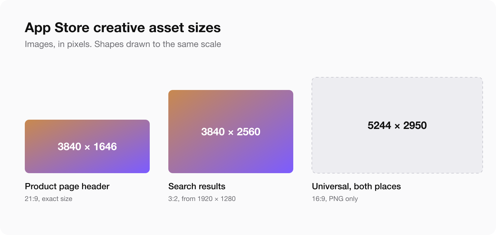
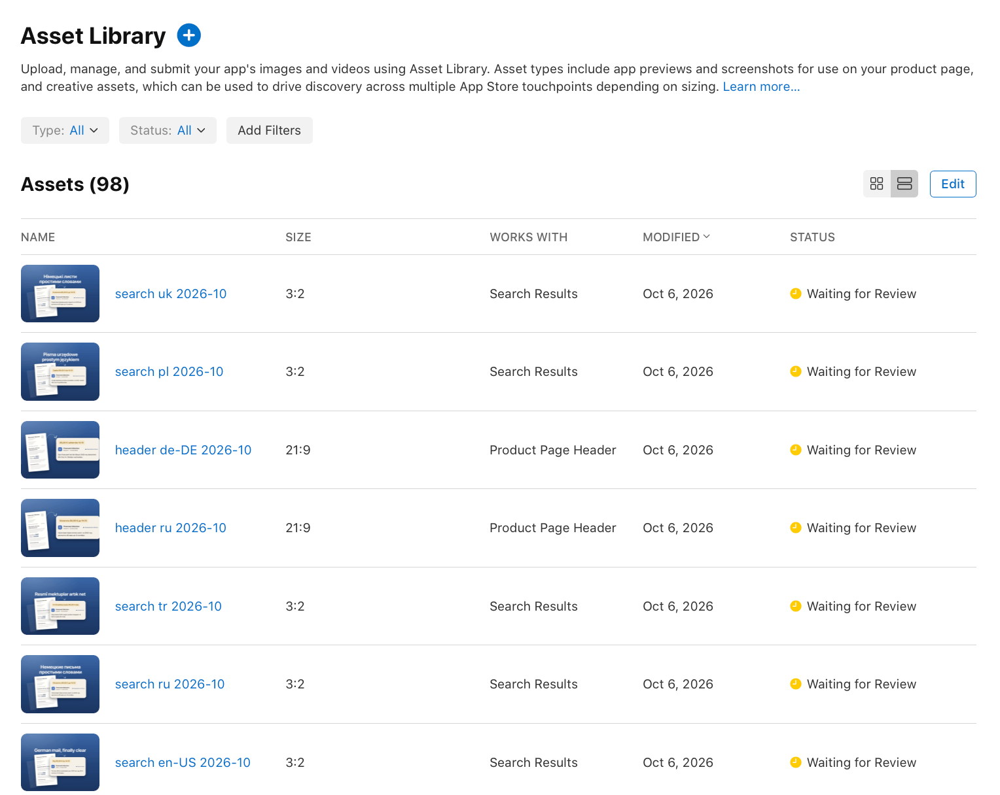
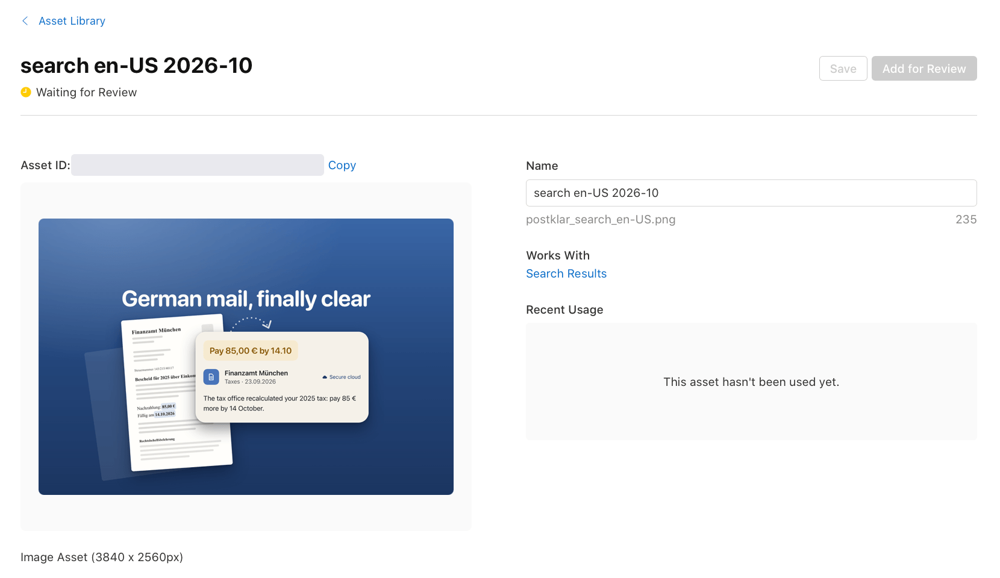
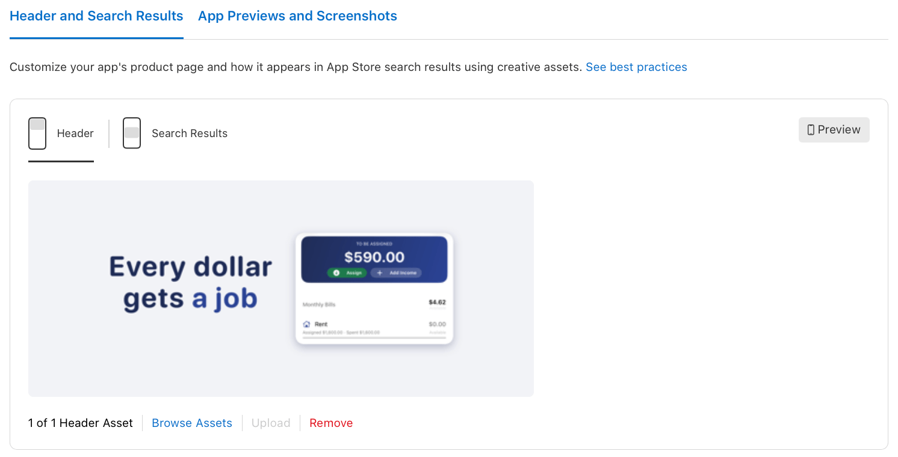
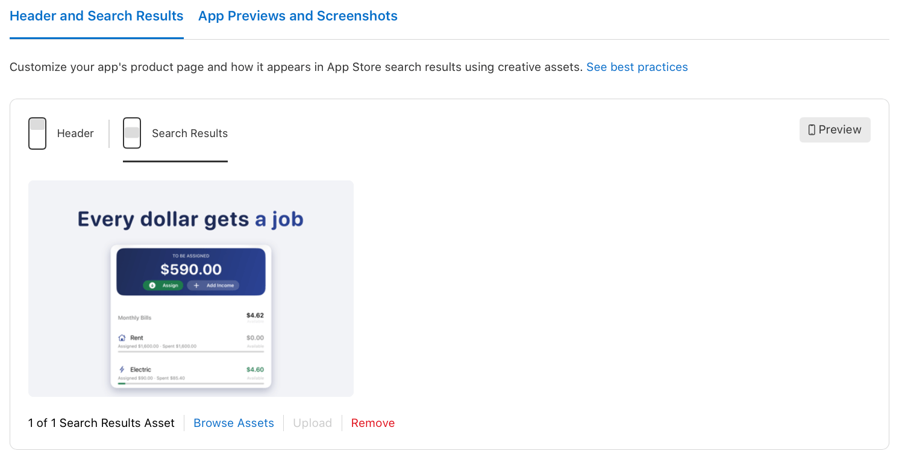
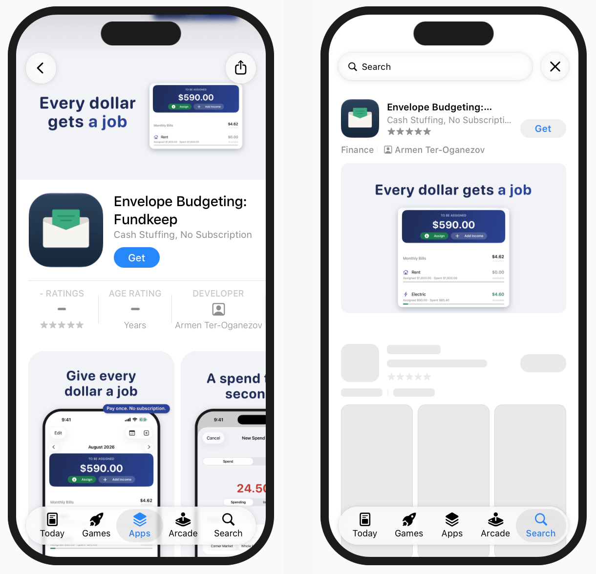

Since 5 October 2026 an app on the App Store can have two new pictures: a header at the top of its product page and its own image in search results. Apple calls them creative assets. They are optional, they show on iOS 27 and iPadOS 27, and they are reviewed separately from the app.

I uploaded them for [Postklar](/apps/postklar/) the next evening: 14 images in seven languages, all through the App Store Connect API. This article has the sizes, the rules, the exact upload steps and an honest list of what I do not know yet. When I wrote this, all 14 were still waiting for review. Update, 9 October: the first approvals are in, for a second app. The numbers are below.

## The sizes

Images, from Apple's specification page:

| Place | Ratio | Size in pixels | Format |
|---|---|---|---|
| Product page header | 21:9 | 3840 × 1646, exact | JPG or PNG |
| Search results | 3:2 | 1920 × 1280 up to 3840 × 2560 | JPG or PNG |
| Universal, for both places | 16:9 | 5244 × 2950, exact | PNG only |

No transparency. An image with an alpha channel is not accepted.

Video works in the same two places:

| Place | Ratio | Size in pixels | Length | Frame rate |
|---|---|---|---|---|
| Product page header | 21:9 | 3840 × 1646 | 5 to 30 s | 30 or 60 fps |
| Search results | 3:2 | 1920 × 1280 up to 3840 × 2560 | 5 to 30 s | 30 or 60 fps |

Formats are MOV, M4V or MP4. Videos loop and start muted. In search they can not be unmuted at all, so a video that needs sound to make sense will not work there. The specification page lists no 16:9 universal video.

## What you may not put on them

- Prices and discounts.
- Website addresses.
- The copyright sign.
- Awards you did not receive, and Apple's own badges such as Editors' Choice or App of the Day.
- Logos of other platforms and stores.

One rule surprised me: every asset has to fit a 4+ age rating, even if the app itself is rated higher. A shooter rated 17+ still needs a header a small child could look at.

## Do you need them

No. If you upload nothing for search, your listing shows what it showed before: in-app events, app previews and screenshots.

Whether a custom image brings more downloads than a row of screenshots, I can not tell you. Nobody outside Apple has numbers yet, and mine are zero because my images are not live.

## What we made for Postklar

Two separate images per language, not the universal one.

The header has no text at all. Apple's advice for it is one clear idea, and the app name is already printed right below it on the page.

The search image carries one short line. In search a person has not decided anything yet, and Apple's advice there is to state the obvious and show the interface.

That difference is the reason we did not use the universal 16:9 file. One file in both places means the same amount of text in both places.

The letter in the picture is invented. No real document was used.

Seven languages, two images each, 14 files of about 1 MB. British English gets the American pair.

Arabic reads from right to left, so the whole layout is mirrored.

None of this was drawn in a graphics editor. The images are an HTML template rendered to PNG by a script, with a second script that checks size, transparency and margins. With 14 files, and more the day we change a word, drawing by hand was not an option.

## Uploading through the API, step by step

In App Store Connect there is a new section, Asset Library. It holds screenshots, app previews and creative assets in one list.

You can upload there by hand. We did everything through the API, and I only watched the list fill up. The API section is called App Asset Library. The calls, in order:

1. `GET /v1/apps/{id}/assetLibrary` returns the library of the app.
2. `GET /v1/appAssetLibraryRefData` returns Apple's reference data: allowed sizes, placement types and limits. The names of the two placements come from here: `PRODUCT_PAGE_HEADER_ASSET` and `APP_STORE_SEARCH_RESULTS_ASSET`.
3. `POST /v1/appAssetLibraryImages` reserves an image: file name, size in bytes, category `CREATIVE_ASSETS`, link to the library. The answer contains upload addresses.
4. `PUT` the bytes to that address. It is temporary, and your API token is not sent to it.
5. `PATCH /v1/appAssetLibraryImages/{id}` with `"uploaded": true` confirms the upload. No checksum is needed, unlike the old screenshot upload.
6. `GET /v1/appAssetLibraryImages/{id}` until the state changes from `UPLOAD_COMPLETE` to `PREPARE_FOR_SUBMISSION`. For us that took from a few seconds to a couple of minutes per file.
7. `POST /v1/reviewSubmissions` with platform `IOS` creates a review submission.
8. `POST /v1/reviewSubmissionItems` adds one image to the submission. One call per file.
9. `PATCH /v1/reviewSubmissions/{id}` with `"submitted": true` sends it.
10. After approval: `POST /v1/appAssetLibraryPlacements` assigns an image to a localization of the app version. For Postklar this step is still ahead. Fundkeep was placed through the API on 9 October.

One detail is missing in the documentation. In step 8 the relationship that points to the image is not named anywhere for a submission that contains only assets. `appAssetLibraryImage` worked on the first try.

A tip for anyone who reads Apple's API documentation with a script: the pages are rendered by JavaScript, so a plain request returns nothing useful. The same content is available as JSON under `developer.apple.com/tutorials/data/documentation/appstoreconnectapi/` followed by the page name and `.json`.

All 14 files were accepted on the first attempt, and Apple recognised each size correctly.

## Review is separate from the app version

This is the part that changes how you work. The 14 images went to review as one submission, with no new build and no new app version. The app already had an approved version, and that is enough.

There is one condition, and we found it by trying. You can attach an asset to a version that is already on sale, but only an approved asset. When we tried with one that was still waiting, the API answered:

> The asset must be in the APPROVED state because the parent is already approved

So the order is fixed: upload, review, then placement.

We submitted on 6 October at 22:37 Berlin time. The next evening, more than 20 hours later, the status was still Waiting for Review. For comparison, in [my data on app review times](/blog/app-store-review-time-2026/) the median wait for an app version was 20 hours.

Update, 9 October. The first batch is through, for [Fundkeep](/apps/fundkeep/): 12 images, six for search and six headers, in six languages. Submitted on 6 October at 20:40 UTC, approved on 9 October at 06:10 UTC. That is about 57.5 hours, almost three times the median for an app version. All 12 were approved in the same second and none was rejected. The Postklar images from the same evening and the six videos are still waiting.

## Placement, and what the Preview shows

Added on 9 October, after the Fundkeep approval. We placed the approved images through the API. One thing got in the way: a product page optimization test was running for the app, and placement did not work until the test was stopped.

In App Store Connect the result is on the app version page, in a new tab called Header and Search Results. It has two slots, and each takes one asset per language. The version here is already on sale. No new version was needed.

The Preview button opens a device preview. This is the first place where you see the real crop.

What I measured on these two screens, iPhone in portrait:

- **Header.** The full height is shown. The sides are cut: about 8 percent on the left and 8 percent on the right, so roughly 84 percent of the width stays visible.
- **Header, top corners.** The back button and the share button sit on top of the image, left and right. The area above the image, under the Dynamic Island, is filled with the colour of the image's top edge.
- **Search image.** The 3:2 image is shown whole, with rounded corners. Nothing is cut.

So for a header: nothing important in the outer 10 percent on each side, and nothing in the top corners. Our own margin was stricter than it had to be.

These numbers are measured from a screenshot of the Preview, for one device in one orientation. Apple writes next to it that the preview is for reference only. The Preview also has an iPad option, and I have not measured that yet.

## Video: one file that went through

Added on 8 October. For a second app, [Fundkeep](/apps/fundkeep/), we made a video for the search slot in six languages. This one I uploaded by hand in Asset Library, with the plus button. All six files were processed without an error or a warning.

The file:

| Property | Value |
|---|---|
| Frame size | 1920 × 1280, ratio 3:2 |
| Length | 8.83 s |
| Frame rate | 30 fps |
| Container | MP4 |
| Video codec | H.264, High profile, yuv420p |
| Bitrate | about 5.6 Mbit/s |
| File size | 6.2 MB |
| Audio | a silent stereo AAC track, 48 kHz |

I do not know whether the silent audio track matters. We did not try a file without one.

You do not upload a poster frame. Apple picked one by itself, at the five second mark in all six files. I have not found a way to change it.

Uploaded and processed is not the same as approved. The six videos have been waiting for review since the evening of 6 October, like the images.

Video also exists in the API, as `appAssetLibraryVideos`. We have only read it there, not uploaded through it.

## Four API errors from the second app

Postklar went through without a single error. Fundkeep, done by a different session, did not. These are the messages and what fixed them:

- `The attribute 'specId' can not be included in a 'CREATE' operation`. Do not send the size specification when you reserve an image. Apple works out the placement from the pixel size.
- `'sourceFileChecksum' is not an attribute on the resource`. Leave the checksum out. `"uploaded": true` is the whole confirmation.
- `STATE_ERROR.ASSET_IN_POST_PROCESSING`. You tried to submit too early. We waited about a minute.
- `MAX_IN_REVIEW_SUBMISSIONS_PER_PLATFORM_LIMIT_REACHED`. No more than two review submissions per platform at a time. Put everything into one.

## Where it got hard

**The safe area has no public numbers.** Apple says the header and the search image are cropped differently on different devices and orientations, and that the important part belongs in the centre. The exact borders are only inside Apple's templates for Figma, Photoshop, Pixelmator and Sketch. We did not open them.

So we set our own margin: everything important inside the middle 60 percent of the width and 70 percent of the height, no text closer than 8 percent to an edge, background running to the edges with nothing that matters in it. That is our guess, not Apple's rule. The Preview tool in App Store Connect shows the real crop once the images are placed. What it showed for our second app is further down.

**The crop check was wrong before the images were.** The script that checks margins measured the browser window, which was 87 pixels shorter than the canvas, and rejected correct images. The first bug we fixed was in the checker.

**Layout in seven languages.** The Russian and Polish sender lines broke into three lines. The headline ran into the letter. In the Arabic version the card covered the highlighted amount and date. Each one was fixed separately.

**The headline itself.** The first Russian, Ukrainian and Polish lines used a hyphen where a dash belongs. In a large headline it looked like a typo. We rewrote the lines so they need neither. The German one became "Behördenbriefe verstehen", so that it contains a word people search for.

**A rule I can not read with certainty.** Prices are banned. Our card says "Pay 85,00 € by 14.10" in large type. That is the amount from the invented letter, not the price of the app, and the same amount is on our approved screenshots. A reviewer who reads the rule literally could still reject it. I will know when the review is done.

One data point since then: the Fundkeep images show "$590.00" inside the app's interface, a budget balance. All 12 passed.

## What I do not know yet

- How long the review of creative assets takes in general. I have one batch: 57.5 hours.
- What is cropped on an iPad and in landscape. For an iPhone in portrait I have a first measurement.
- Whether the amount on the Postklar card passes the price rule. A dollar amount inside an app screenshot did.
- Whether any of this changes downloads.

This article is updated as the answers come in.

## A short list for your own app

1. Decide between two images and one universal file. Two give you different text for the page and for search.
2. Export at the exact size: 3840 × 1646 for the header, 3840 × 2560 for search. No transparency.
3. Keep the important part in the centre and let the background run to the edges.
4. Check the image against a 4+ rating, even if your app is not 4+.
5. Remove prices, web addresses and the copyright sign.
6. Localize the text, and mirror the layout for right-to-left languages.
7. Submit early. Review runs on its own, and you can not place an asset before it is approved.
8. If you have many files, script it. The ten calls above are the whole flow.

## Questions people ask

### What size is the App Store product page header?

3840 × 1646 pixels, ratio 21:9, JPG or PNG without transparency. The size is exact, there is no range.

### What size is the App Store search results asset?

Ratio 3:2, from 1920 × 1280 up to 3840 × 2560 pixels, JPG or PNG without transparency.

### What is the safe area of the product page header?

Apple publishes no numbers outside its design templates. In the Preview tool, on an iPhone in portrait, our 21:9 header kept its full height and lost about 8 percent on each side. The back and share buttons cover the top corners. The 3:2 search image was shown whole.

### Can one image be used for both the header and search?

Yes. Apple calls it the universal creative asset: 5244 × 2950 pixels, 16:9, PNG only. The price is that both places show the same picture and the same text.

### Do creative assets need a new app version?

No. They go into a review submission of their own. The app needs an approved version, and an asset has to be approved before it can be placed.

### How long does the review of creative assets take?

Our first batch took about 57.5 hours: 12 images submitted on 6 October 2026 and approved on 9 October. That is one data point from the first week of the feature, not a rule.

### Are creative assets required?

No. Without a search results asset the App Store shows in-app events, app previews and screenshots, as before.

### Do they work on the Mac App Store?

Apple names iOS 27 and iPadOS 27 and later. For my Mac apps I have uploaded nothing.

Sources: Apple's [asset best practices](https://developer.apple.com/app-store/asset-best-practices/) and [creative assets specifications](https://developer.apple.com/help/app-store-connect/reference/app-information/creative-assets-specifications/).
