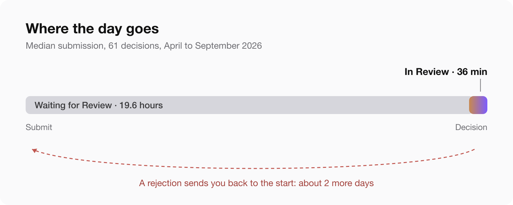
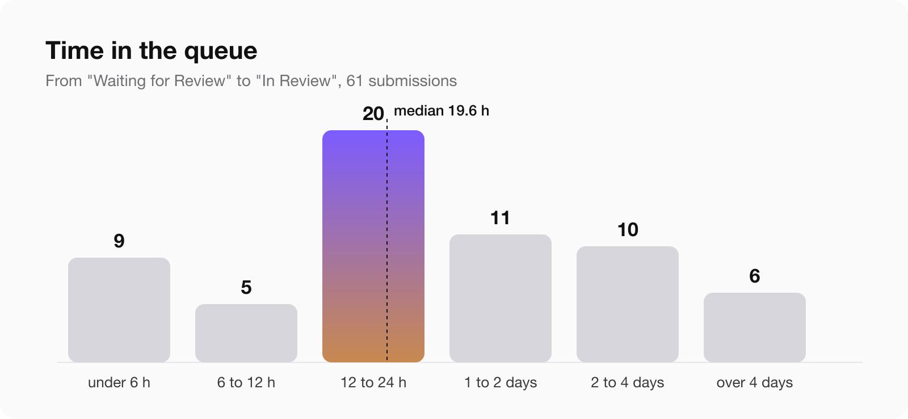
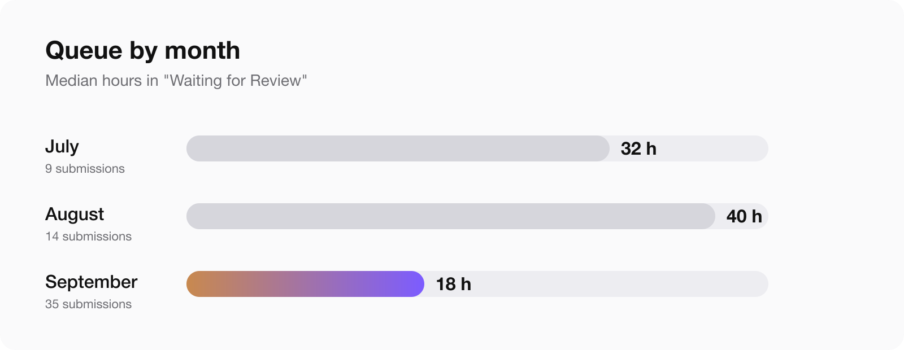

Short answer on App Store review time, from my own submissions between April and September 2026: an app waits about 20 hours in the queue, then the review itself takes about 36 minutes. Half of all decisions arrived within a day of pressing submit. First versions take longer, and the reason is rejections, not the queue.

I ship eight apps, iPhone and Mac, and every status change sends an email from App Store Connect. I went through all of them: 91 submissions, 61 of them with both a start of review and a decision on record. Here is what they say.

## App Store review time in 2026: the numbers

| Step | Median | Half of cases between | Nine in ten under |
|---|---|---|---|
| Waiting for Review, until In Review | 19.6 h | 15 and 50 h | 93 h |
| In Review, until a decision | 36 min | 6 min and 2.2 h | 22 h |
| Submit to decision | 24.4 h | 18 and 66 h | 143 h |

Twenty-seven of the 61 decisions came in less than 24 hours after submitting, and 41 in less than 48. The fastest approval took 1 hour 10 minutes from submit to done. The slowest wait in the queue was 13 days.

So when an app has been "Waiting for Review" for a day, nothing is wrong. That is the normal state. The review itself is short: in 38 of 61 cases the reviewer made a decision in under an hour.

## Where the time actually goes

The queue is almost all of it. How long the review lasts once it starts:

| Review took | Submissions |
|---|---|
| under 15 minutes | 21 |
| 15 to 60 minutes | 17 |
| 1 to 6 hours | 15 |
| 6 to 24 hours | 2 |
| more than a day | 6 |

The six long ones are the interesting part. Each of them is a review that stopped with a question: the reviewer wanted a demo video, a working purchase, an answer in Resolution Center. The clock keeps running while the app sits in "In Review" and nobody on your side knows it is waiting for you.

## Approved versus rejected

| Outcome | Submissions | Median submit to decision |
|---|---|---|
| Approved | 38 | 20 h |
| Rejected | 23 | 51 h |

A rejection does not come faster than an approval. It comes later, and then the whole cycle starts again. Rejected submissions also waited longer in the queue before anyone looked at them: 44 hours median, against 18 for approved ones. I cannot tell from email alone why. My guess is that resubmissions after a rejection land in a different queue, but that is a guess.

What this means in practice: one rejection costs about two days, not one. Twenty-three of my 61 submissions were rejected, and almost all of them were first versions.

## Why first versions take longer

Every rejection in this set taught me one rule:

- **2.4.5(iii), launch at login.** The Mac app registered itself as a login item by default. Consent has to be a user action, even if the switch is visible.
- **5.1.1(iv), permission button.** A button before the camera prompt said "Allow". It has to say "Continue".
- **2.1(a) and 2.1(b), unreachable purchase.** Without the hardware the app needs, the reviewer could not find the in-app purchase.
- **5.2.5, Apple trademarks.** The word "Mac" in an app name in two localisations.
- **Mac menu.** A Mac app got two rejections in a row because the "New Window" menu item did nothing.
- **In-app purchase not attached.** A new purchase has to be submitted together with the version, not on its own.

The first one of these, a Mac webcam app, took 14 and a half days and four rejections from first submit to the store. I wrote that one up in detail: [Four App Review rejections in 15 days](/blog/mac-app-review-four-rejections/). Its later updates took less than two days, and the last one 15 hours 52 minutes.

## iOS app review time vs the Mac App Store

| Platform | Submissions | Median queue |
|---|---|---|
| iOS | 41 | 19 h |
| macOS | 20 | 23 h |

The Mac queue was slightly slower. The bigger difference is that the two are separate submissions, decided separately, by reviewers who check different things. An app approved on iPhone can still be rejected on Mac the same week for a menu item.

## Is App Review getting slower?

It did not look like it from here. Median time in the queue by month:

September was the fastest month of the year so far. August was the slowest, which fits the usual pre-release rush before a new iOS.

## When review starts

In Review started on a Monday 22 times out of 61, more than any other day. Most of my submissions went in on a Sunday, so a weekend submission simply starts on Monday. It did not wait much longer, though: submissions from Friday to Sunday had a median queue of 21 hours against 19.5 for Monday to Thursday.

Most reviews started between 13:00 and 19:00 Berlin time, which is early morning in California.

## How to request an expedited app review

I asked for it once, on 14 September, after the third rejection of the webcam app. Things I did not expect:

1. The request is not in App Store Connect itself. It is a form on developer.apple.com, under Contact, topic "Request an expedited app review". People search for an "App Store Connect expedited review" button, and there is none.
2. In 2026 the form asks only for the app name and the platform. There is no field for the reason.
3. It was granted the same day.
4. It carried over. When the app was rejected again, the resubmission went back into the expedited queue without a new request, and Apple's reply said so.

Use it for something real: a broken release, a deadline, a security fix. It is not a tool for every update, and with a median of 20 hours most updates do not need it.

## Traps that add days

- **Replying is not resubmitting.** If you upload a new build after a rejection, answering the reviewer is not enough. You have to press "Resubmit to App Review", or the version sits in "Prepare for Submission" and nobody opens it.
- **The binary check comes first.** Seven of my submissions bounced as "Invalid Binary" within a minute, before any queue. Check the processing email before you wait.
- **"Complete" means nothing.** In the App Store Connect API a finished submission is "COMPLETE" whether it was approved, rejected or cancelled. Only the status emails tell you which.
- **The emails go to your Apple ID.** Not to your work address, not to your team. If you want to measure your own review times, that inbox is the only complete record.

## How to spend less time in review

1. Submit updates without new promises. Mine went through in hours.
2. Before a first version, read the guidelines you are most likely to hit: 2.1, 2.3, 2.4.5, 5.1.1, 5.2.5.
3. Put the exact click path to every paid feature at the top of the review notes.
4. If the app needs hardware, send a video with the first submission and make every screen reachable without it.
5. Attach new in-app purchases to the version.
6. After a rejection, fix and resubmit the same day. The queue is where the days go, not the fix.
7. Keep expedited review for the day you really need it.

## Questions people ask

### How long does App Store review take in 2026?

In my data, a median of 24 hours from submit to decision: about 20 hours waiting in the queue and about 36 minutes of review. Half of all decisions came within a day.

### Why is my app stuck in "Waiting for Review"?

Almost certainly because it is in the queue. A day is normal, two days is common, and one in ten waits longer than four days. The review itself usually takes less than an hour once it starts.

### How do I request an expedited App Store review?

Through the contact form on developer.apple.com, topic "Request an expedited app review". In 2026 it asks only for the app name and platform. Mine was granted the same day and stayed in force after a rejection.

### What is the average Apple app review time?

In this sample the average is skewed by a few long waits, so the median is the honest number: about 20 hours in the queue and 36 minutes of review. Apple itself says most submissions are reviewed within a day, and my data agrees for updates.

### What is the App Store approval time for an update?

Updates without new features or new purchases were approved fastest, from about an hour to a day. First versions took days to weeks, almost always because of a rejection.

### Does a rejection make the next review faster?

No. Rejected submissions in my data waited longer, a median of 51 hours from submit to decision against 20 for approved ones.

### Is Mac App Store review slower than iOS?

Slightly: a median of 23 hours in the queue against 19. The bigger difference is that Mac reviewers check Mac things, like working menu items.

## How I measured

All numbers come from App Store Connect status emails for eight apps from April to September 2026. Waiting for Review marks the submission, In Review marks the start, and the "submission is complete" or "There's an issue" email marks the decision. Outcomes come from the emails that follow within the hour. Of 91 submissions, 61 have a clear start, decision and outcome; the others were withdrawn by me, bounced as invalid binaries, or have no clear outcome in email. Times are Berlin time. It is one developer's apps, so read it as a sample, not as Apple's average.

If your numbers look different, write to me. I would like to add them.
