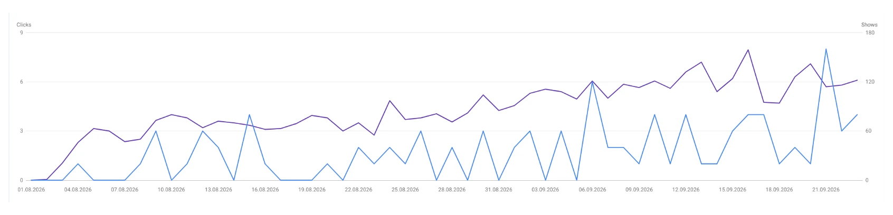
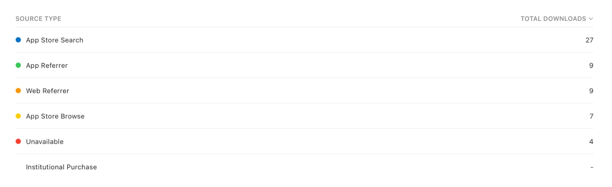
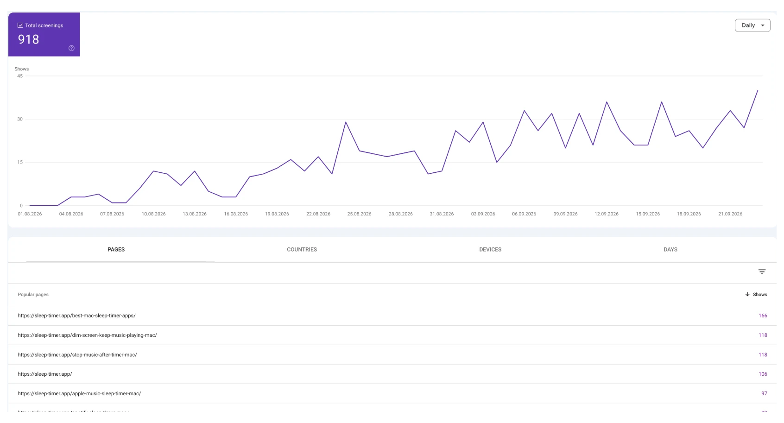

For two years [Sleep Timer](/apps/sleep-timer/) had no website. It lived in the Mac App Store, people found it through App Store search or not at all, and I thought that was how a $2.99 utility works.

On 2 August 2026 I gave it a site. One evening, Claude Code and me: it wrote the drafts, I corrected them, and we picked the topics together in a brainstorm. Four languages, English, German, French and Japanese, mostly because the app itself already had them.

Then I checked Search Console every day, hoping for the first click. I did not expect much. Eight weeks later the numbers are better than I hoped, and they say something specific about what a website does for an app. Here they are, with the parts that did not work.

## The numbers, eight weeks in

Google Search Console, 2 August to 25 September:

| | |
|---|---|
| Impressions | 4,700 |
| Clicks | 91 |
| Average position, first week | 25 |
| Average position, last week | 7 |

App Store Connect, sources of downloads, 26 August to 24 September:

One in six first downloads now arrives from the web. By proceeds the web share is a bit higher, about one in five. Before August that row did not exist.

The downloads are the number that matters. Everything else on this page explains where they come from.

## The home page is not the page that works

I assumed the home page would carry the site. It does not. The pages that bring people are the ones that answer one question each:

| Page | Impressions | Clicks |
|---|---|---|
| Best Mac sleep timer apps | 673 | 15 |
| Dim the screen, keep music playing (Japanese) | 428 | 12 |
| Home page | 312 | 10 |
| Best sleep timer apps (German) | 200 | 10 |
| Spotify sleep timer on the Mac | 564 | 6 |
| Stop music after a timer | 422 | 5 |

The pattern: a person types a problem, "dim screen but keep music playing mac", lands on a page that answers exactly that, and some of them go on to the app. The home page only catches people who already know the name.

That changed how I think about an app site. It is not a brochure with a download button. It is a set of answers to the questions people already ask, and the download button sits at the end of each answer.

## Japan came first, and we did not plan it

Clicks by country over the same period:

| Country | Clicks |
|---|---|
| Japan | 23 |
| Germany | 13 |
| United States | 11 |
| France | 10 |

The Japanese pages were translated because the app was already in Japanese, not because of a market plan. They now bring more clicks than the English ones. The query that does it is "macbook 閉じても音楽再生", keep music playing with the lid closed, and the Japanese page for it sits around position 9 with almost no competition.

This is the second time a local language has done more for an app than anything in English. The [App Store keywords article](/blog/app-store-keywords-what-moved/) tells the same story about Vietnam. If your app is already localised, the site should be too. It is the cheapest reach you will get.

## A fifth of the impressions are AI answers

Search Console has a new report, still marked beta: impressions in Google's generative AI features, the AI answers at the top of a results page.

For sleep-timer.app it shows 918 impressions in three months against 4,700 in regular search. About one in five times the site appears on Google, it appears inside an AI answer. The line goes from zero in early August to thirty or forty a day now, and it climbs faster than the regular one.

The same pages lead here: the best-apps list, the dim-screen page, the stop-music page. Pages that answer a question in plain words are the ones an AI answer quotes.

There is a cost to this, and it shows in the data. Several question queries have the site at position 1 with zero clicks: "can i set a sleep timer on my mac", "can you put a sleep timer on macbook". Position 1, nobody clicks. The AI answer gives them the answer, sometimes with the app's name, and they never open the page. I cannot measure how many of those become downloads. Some do: the web referrer row in App Store Connect grew while clicks stayed flat.

## What did not work

**The head term.** "sleep timer mac" sits at position 28. "mac sleep timer" too. We built the site around a cluster of pages hoping to lift that one query, and eight weeks later it has not moved. The first page for it belongs to Apple support pages, big software blogs and the App Store itself. A new domain does not get in there by writing well. It will take links and time, and it may never happen. The long queries were where the wins were.

**First page, no clicks.** "macbook sleep timer app" is at position 6 with 87 impressions and not a single click. Being on the first page is not the same as being chosen, especially below an AI answer and an App Store result.

**Campaign tracking.** Every download button carries an App Store campaign parameter. App Store Connect shows nothing for it: the campaigns report needs more installs than a small utility gets in a month before it displays anything. The source-type table still works, so I know web referrals exist, just not which page sent them.

## What it cost

One evening for the site: structure, home page, six answer pages, four languages. Claude Code drafted, I corrected every page, and I would not publish anything I had not read. No designer. Hosting on Cloudflare Pages costs nothing at this size.

Since launch: nothing. No new pages, no link building, no ads. The numbers above are what a one-evening site does on its own.

## How to repeat it

If you have an app in the store and no site, this is the whole method:

1. Write down the ten questions people ask before they find your app. Not features, questions. "Can I set a sleep timer on my Mac?" "Does Apple Music have a sleep timer?"
2. Give each question its own page with a plain answer, and the app at the end.
3. Add a "best apps for X" page that includes competitors honestly. It was our top page.
4. Translate into every language the app already has.
5. Put a campaign parameter on every store link anyway. One day the report will show something.
6. Add the site to Search Console the day it goes live, then leave it alone for eight weeks.
7. Do not build the site around one head term. Build it around the long questions, and let the head term come if it comes.

## Questions people ask

### Does a Mac or iPhone app need a website?

For discovery, yes. App Store search only finds people who are already in the App Store. A site catches people who ask Google a question first, and for this app that is one download in six.

### How long does an app website take?

One evening for a static site with a handful of answer pages, if the texts come from you and an assistant drafts them. The translation is the part that scales for free if the app is already localised.

### Which pages should an app website have?

Answer pages to real questions, one question each, and a "best apps" comparison. The home page matters less than you think.

### Does Google's AI answer take clicks away?

Yes and no. For question queries the site appears at position 1 and gets no click, because the answer is on the results page. But the app name travels with the answer, and web referrals in App Store Connect grew anyway.

### Can you see which page sent a download?

Not below a certain volume. App Store Connect shows the web referrer source type, but the per-campaign report stays empty for a small app.

If you have numbers from your own app site that say something different, write to me. I would rather correct this than keep a nice story that turned out wrong.
