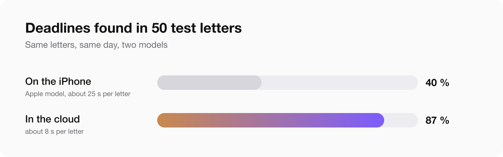
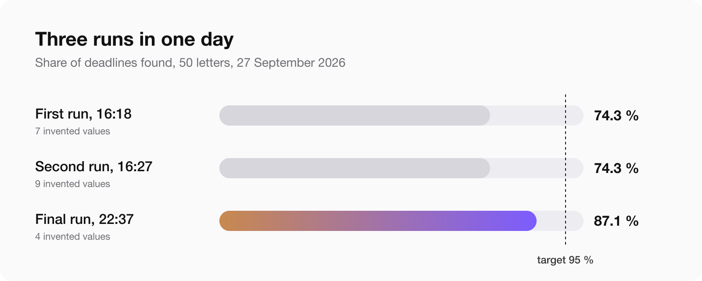

[Postklar](/apps/postklar/) went on sale today. You photograph a letter from a German authority, and it tells you in plain words what the letter says, what you have to do, by when and how much. In seven languages, because the people who need this most did not grow up with German.

The first commit was on 27 September. The app went to App Review the next evening and into the store on 3 October. Six days.

This is not a success story. The app has been on sale for one day and I know nothing yet about how it does with strangers' letters. It is a story about how it was built, and about three decisions I would repeat in any app that puts a language model between a user and something that matters.

## The design I liked lost to a number

The plan was privacy first. Apple ships a language model on the iPhone now, so the letter would be explained on the device, and the cloud would be an option for people who wanted more.

It sounded right. It was also the version I wanted to write about.

Before building the screens, we wrote 50 test letters: tax office, job centre, health insurer, court, debt collector. Each one with a known deadline, amount and reference number. Then we ran both models over them on the same day.

The model on the phone found 19 of 47 deadlines. The cloud model found 61 of 70. One took about 25 seconds per letter, the other about 8.

A letter explainer that misses six deadlines in ten is not private, it is useless. We flipped the design that evening: the cloud is the default, after an explicit consent screen that names who receives the text, and the on-device model is a private mode you switch on.

Without the test letters the app would have shipped with a beautiful architecture and a bad answer.

A second thing the numbers caught: the tests passed on the Mac and the first builds failed on the phone. Apple's on-device model has a context window of 4,096 tokens on the iPhone and twice that on the Mac. A two-page German letter plus instructions did not fit. The private mode has its own, much shorter instructions because of that.

## The model understands, the code counts

This is the rule I would carry to any other app. Wherever a mistake costs money or a legal right, the model is not allowed to produce the final value.

**Numbers are checked against the letter.** After the model answers, ordinary code compares every value with the text that was recognised on the page.

| Value | How the code checks it |
|---|---|
| Amount | Must be one of the numbers printed in the letter |
| IBAN, reference number | Compared without spaces and punctuation; the IBAN checksum is computed |
| Exact date | Must be printed in the letter |
| Relative deadline, "within one month" | The model has to quote the sentence; the code looks for that quote in the letter |

What is not found in the letter is not deleted. It is shown with a warning mark, so you can see it was not confirmed.

One small thing took an afternoon: scanned text contains invisible zero-width characters, and they were hiding printed numbers from the check.

**Dates are never calculated by the model.** It returns a rule: how many days or months, counted from what, and the quote. The date is computed by code.

That split exists because of a mistake. In the first versions the model did the arithmetic and wrote "one month" as 30 days. A month and 30 days give different dates, and with an objection deadline the difference can cost you the right to object.

The code follows the legal presumption: in Germany a letter counts as delivered on the fourth day after posting, in Austria on the third working day. A deadline that falls on a weekend moves to Monday. Public holidays are not counted, and the app says so next to the date, together with every other assumption it made.

## Three runs in one day, and the target we missed

| Run | Deadlines | Amounts | Reference numbers | Invented values |
|---|---|---|---|---|
| First, 16:18 | 74.3% | 76.5% | 79.9% | 7 |
| Second, 16:27 | 74.3% | 85.3% | 96.3% | 9 |
| Final, 22:37 | 87.1% | 88.1% | 93.4% | 4 |

The target was 95 percent for deadlines and amounts and zero invented values. We did not reach it, and the app shipped anyway, with the checks above as the safety net.

Said plainly: roughly one deadline in eight and one amount in eight in the test set were not found. In the final run four values in 50 letters were invented: two IBANs, an amount of 0.00 EUR and one relative deadline. The check marks them, it does not remove them. The letters that go wrong are the ones crowded with numbers: fines, court letters, debt collection, insurance.

Read the letter yourself as well. The app says the same thing on every card: this is an explanation, not legal advice.

## What App Review asked

The review paused on 1 October with Guideline 2.1, Information Needed. Not a rejection. Three questions, word for word:

> Does your app rely on third party AI ?
>
> Does your app share any information with third party ?
>
> If yes , what information is shared with third party ?

My first idea was to lead with the on-device mode, because it sounds good. The planning session disagreed: the cloud is the default, the consent screen is right there in the app, and an evasive answer next to a visible consent screen is how an information request turns into a rejection.

So the answer started with "yes". The explanation is made by Claude, Anthropic's model, through our server in the EU. The text is sent only after consent on a separate screen that names the recipient. In private mode the letter never leaves the phone. Text recognition always runs on the device. Then the list of what each third-party service receives.

Nothing changed in the app. No new build. Approved on 3 October.

The lesson is cheap: all of that could have been in the review notes at submission, and the question would not have been asked. The longer story of what review notes are for is in [four rejections in 15 days](/blog/mac-app-review-four-rejections/), and the timing of all this is in [how long App Store review takes](/blog/app-store-review-time-2026/).

One oddity: the app is iPhone only, and it was reviewed on an iPad.

## What a person caught and the tests did not

Three things, all found with a phone in the hand:

- **A test menu in the release build.** A hidden debug menu appeared depending on the type of purchase receipt. A reviewer works with exactly that kind of receipt and would have seen it. Found the evening before submission.
- **A counter that did not count.** The number of free letters on the button did not go down after a cloud analysis. Found the day after release, fixed in 1.0.1.
- **Keywords chosen by feel.** The name said "erklärt". People search "brief erklären" and "brief verstehen", and the store does not treat those as the same word. The app was not in the results at all. The lesson from [the keywords article](/blog/app-store-keywords-what-moved/) applied to my own app one week later.

## The law moved while we wrote the guides

On release day another session was writing guide pages for the site and checking every deadline against the text of the law. That is how it noticed that the benefit under SGB II now has a new name, and the app's own knowledge base still used the old one. Fixed the same day.

Nobody was looking for that. It turned up because someone had to cite the paragraph.

## What I do not know

- How the app does on real letters from people I have never met. The test set is synthetic: 51 letters written for testing, 43 of them German.
- Whether the Arabic, Turkish and Polish texts read well. No native speaker has proofread them.
- Handwriting, bad photos and tables were not measured, so I claim nothing about them.
- No lawyer has reviewed the texts or the deadline rules.

## How it went this fast

Four agent sessions: planning, the app, the server and site, design. I carried the work orders between them and tested every build on my own real letters.

Two days to submission were possible because nothing in App Store Connect was done by hand. Texts, prices, subscriptions and screenshots went in through scripts. My time went where it should: testing and deciding.

## If you build an app on a language model

1. Write the test set before the screens. Fifty cases with known answers changed the whole design here.
2. Measure on the real device. The phone and the Mac are not the same machine for an on-device model.
3. Let the model read and let code compute. Dates, sums and account numbers get checked or calculated by ordinary code.
4. Show what was not confirmed. A warning mark is more honest than a deleted value.
5. Publish your assumptions next to the result.
6. Tell App Review about third-party AI in the review notes, before they ask.
7. Keep a person with a phone in the loop. Three of the worst bugs here were invisible to tests.

## Questions people ask

### Does Apple reject apps that use third-party AI?

Not for that alone. In this case review paused under Guideline 2.1 and asked whether the app relies on third-party AI and what it shares. A direct answer, a consent screen that names the recipient and a matching privacy policy were enough. No new build was needed.

### Is Apple's on-device model good enough for document extraction?

For this task, not yet. On 50 test letters it found 40 percent of deadlines against 87 percent for a cloud model, and it was three times slower. The 4,096-token context window on the iPhone is the main limit. It works as a private mode for short letters.

### How do you stop a language model from inventing numbers?

You cannot stop it, you can catch it. Every amount, date and account number is compared with the recognised text of the document by ordinary code, and anything that is not on the page gets a visible warning.

### Why not let the model calculate the deadline?

Because it got "one month" wrong, as 30 days. The model returns the rule and the quote, and code computes the date with the delivery presumption and the weekend rule.

### How long did App Review take for an AI app?

Submitted on 28 September, information request on 1 October, approved on 3 October after one answer.

If you have built something similar and your numbers look different, write to me. I would like to compare.
